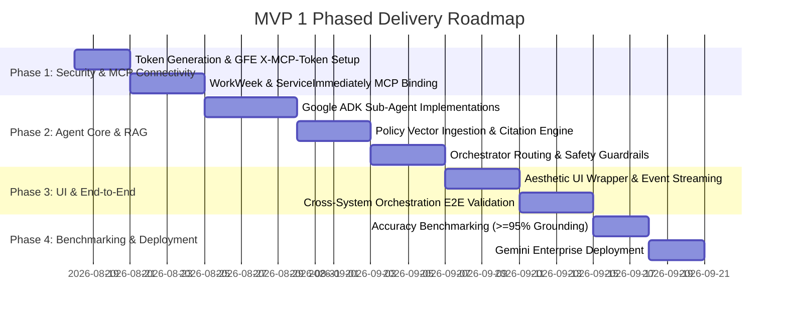

# HR Agentic Solution (MVP 1) — Comprehensive Solution Plan & System Architecture

---

## 1. Executive Summary & Project Context

The **HR Agentic Solution (MVP 1)** is an enterprise-grade, AI-driven multi-agent virtual assistant designed to provide employees with frictionless, conversational self-service. By bridging core enterprise platforms—**WorkWeek (HCM)**, **ServiceImmediately (ITSM)**, and internal **HR Policy Repositories**—the system eliminates manual context switching, deflects routine helpdesk inquiries, and orchestrates complex multi-step cross-system workflows.

### Key Objectives (BRD Aligned):
- **Deflect Tier 1 HR/IT Queries**: Target $\ge 40\%$ deflection of routine inquiries within 6 months through grounded policy retrieval.
- **Self-Service Transactions**: Enable direct leave balance checks, leave submissions, contact updates, and ticket lifecycle tracking via natural language.
- **Cross-System Orchestration**: Validate end-to-end multi-agent execution across policies, HCM, and ITSM (e.g., Medical Leave, Equipment Procurement, Relocation).
- **Enterprise AI Governance & Zero-Trust Security**: Zero-trust execution, 0% policy hallucinations, strict tenant/role-based data isolation, SPII redaction, GFE-compliant header authentication, and deterministic guardrails.

---

## 2. Target System Architecture

The solution uses a decoupled architecture where a lightweight, visually engaging UI wrapper interfaces with a **Google ADK (Agent Development Kit)** multi-agent runtime. The agents interact with enterprise backends through the **Model Context Protocol (MCP)** over stateless Streamable HTTP and direct tool integrations.


### Architectural Layers:

1. **Client / Presentation Layer (Decoupled UI Wrapper)**:
   - Modern, responsive web chat interface built with animated micro-interactions and high-contrast accessible color themes.
   - Fully decoupled from the backend; communicates via REST API (`/api/chat`) and Server-Sent Events (SSE) or WebSockets.
   - Dual-deployment capability: Can run standalone or be embedded directly into **Gemini Enterprise**.

2. **Agent Orchestration Layer (Google ADK)**:
   - **Central Orchestrator Agent (`hr_orchestrator`)**: Analyzes intent, manages conversation state, performs safety checks, and coordinates delegation across domain specialists.
   - **Specialized Sub-Agents**:
     - **HR Policy Specialist Agent (`policy_agent`)**
     - **WorkWeek HCM Specialist Agent (`hcm_agent`)**
     - **ServiceImmediately ITSM Specialist Agent (`itsm_agent`)**

3. **Security, Authentication & MCP Transport Layer**:
   - **Custom Header Transport (`X-MCP-Token`)**: Circumvents Google Frontend (GFE) standard `Authorization` header interception.
   - **Stateless Streamable HTTP**: Direct integration with mounted FastMCP servers.
   - **Tenant Context Verification**: Enforces that authenticated sessions can only read/write their own employee data.

4. **Enterprise Backend Layer (Mock SaaS Ecosystem: `mock-saas.aishprabhat.demo.altostrat.com`)**:
   - **HR Policy Knowledge Base**: Curated policies (PDFs, Markdown) indexed for semantic retrieval.
   - **WorkWeek FastMCP Server (`/work-week/mcp/`)**: Core HR system for profiles, leave accruals, and PTO submissions.
   - **ServiceImmediately FastMCP Server (`/service-immediately/mcp/`)**: IT Service Management platform for incident logging, comment timelines, and status lifecycle management.

---

## 3. Security, Authentication & Token Architecture

Enterprise security and zero-trust governance are foundational to the system's design.

```
┌─────────────────────────────────────────────────────────────────────────────┐
│                             Authentication Flow                             │
│                                                                             │
│  1. Token Minting:                                                          │
│     POST /api/mcp-tokens  ──► { "token_name": "hr-agent-prod" }             │
│                           ◄── Returns { "token": "mcp_abc123..." }          │
│                                                                             │
│  2. Agent Tool Invocation (GFE-Safe Transport):                              │
│     ADK McpToolset ──► Streamable HTTP Request                              │
│                        Header: "X-MCP-Token: mcp_abc123..."                 │
│                        Endpoint: https://mock-saas.../work-week/mcp/        │
│                                                                             │
│  3. Tenant Isolation & Identity Context:                                    │
│     FastMCP Server verifies token ownership.                                │
│     Enforces: Caller ID == Target Employee ID (blocks cross-user tampering) │
└─────────────────────────────────────────────────────────────────────────────┘
```

### Security Specifications:
1. **GFE Header Compliance**: Standard OAuth/Bearer headers are intercepted and strictly parsed by Google Frontend (GFE). To ensure uninterrupted end-to-end authentication with FastMCP sub-applications, all MCP requests transmit the Personal Access Token via the custom header:
   ```http
   X-MCP-Token: mcp_your_token_here
   ```
2. **Token Management API (`/api/mcp-tokens`)**:
   - `POST /api/mcp-tokens`: Dynamically mints new Personal Access Tokens.
   - `GET /api/mcp-tokens`: Lists active tokens and expiration metadata.
   - `DELETE /api/mcp-tokens/{token_id}`: Revokes tokens instantaneously.
3. **Tenant & Data Isolation (FR-1.5)**: Every resource read (`workweek://employees/{id}/profile`) and tool execution (`request_time_off`) verifies identity context. Queries attempting to access other employee records without administrative delegation are blocked and logged.
4. **SPII Data Redaction (FR-1.4)**: User inputs, tool payloads, and chat logs are scrubbed for sensitive personally identifiable information (credit cards, national IDs, passwords).

---

## 4. Live FastMCP Server Catalog & Tool Mappings

The backend exposes two stateless **FastMCP** applications mounted over Streamable HTTP transport at `https://mock-saas.aishprabhat.demo.altostrat.com`.

### A. WorkWeek Server (`/work-week/mcp/`)

#### Resources:
- `workweek://employees/{employee_id}/profile`: Returns core metadata (name, email, role, home address, phone number, manager ID).
- `workweek://employees/{employee_id}/timeoff`: Returns raw database leave balances (accrued and used vacation/sick days).

#### Tools:
| Tool Name | Parameters | Description & Guardrails |
| :--- | :--- | :--- |
| `get_current_employee_id()` | *None* | Resolves the verified employee ID of the authenticated user session. |
| `get_employee_balances` | `employee_id: str` | Fetches remaining vacation and sick leave balances. Live fetch on every turn. |
| `request_time_off` | `employee_id`, `start_date`, `end_date`, `leave_type`, `days` | Books PTO. Validates date format (`YYYY-MM-DD`), chronological ordering ($Start \le End$, no past dates), and balance sufficiency ($Days \le Remaining$). |
| `update_personal_info` | `employee_id`, `address`, `phone` | Updates contact details. Enforces minimum 5 chars on address and phone regex: `^\+?[\d\s\-()]{7,20}$`. |
| `get_personal_info` | `employee_id: str` | Fetches current home address and personal phone number. |
| `get_leave_requests` | `employee_id: str` | Retrieves full historical timeline of submitted leave requests. |
| `cancel_leave_request` | `employee_id: str`, `request_id: int` | Cancels a pending/approved request and restores balance. |

---

### B. ServiceImmediately Server (`/service-immediately/mcp/`)

#### Resources:
- `serviceimmediately://tickets/{ticket_id}`: Returns ticket details, current status, assignment details, and comment timelines.

#### Tools:
| Tool Name | Parameters | Description & Guardrails |
| :--- | :--- | :--- |
| `list_tickets` | `employee_id: str` | Lists all support incidents requested by the employee. |
| `create_ticket` | `requested_by`, `category`, `short_description`, `priority`, `assignment_group='Service Desk'` | Opens new ticket. Rejects duplicate submissions within 5 minutes. Enforces that `priority='1 - Critical'` tickets describe active outages, crashes, or downtime keywords. |
| `add_ticket_comment` | `ticket_id`, `author`, `comment` | Appends a comment to the ticket activity timeline. |
| `update_ticket_status` | `ticket_id`, `status`, `resolution_notes=''`, `updated_by='System'` | Enforces the ITSM state machine: `New` $\rightarrow$ `In Progress`/`Closed`; `In Progress` $\rightarrow$ `Resolved`/`Closed`; `Resolved` $\rightarrow$ `In Progress`/`Closed`. `Closed` tickets are immutable. |

---

## 5. Google ADK Multi-Agent Implementation Code

Below is the production-ready ADK multi-agent configuration leveraging `McpToolset` with `StreamableHTTPConnectionParams` and custom headers.

```python
import os
from google.adk.agents import Agent, LlmAgent
from google.adk.tools.mcp_tool import McpToolset
from google.adk.tools.mcp_tool.mcp_session_manager import StreamableHTTPConnectionParams

BASE_URL = "https://mock-saas.aishprabhat.demo.altostrat.com"
MCP_TOKEN = os.getenv("MCP_TOKEN", "mcp_functional_token_here")
AUTH_HEADERS = {"X-MCP-Token": MCP_TOKEN}

# 1. Initialize WorkWeek MCP Toolset
workweek_toolset = McpToolset(
    connection_params=StreamableHTTPConnectionParams(
        url=f"{BASE_URL}/work-week/mcp/",
        headers=AUTH_HEADERS
    )
)

# 2. Initialize ServiceImmediately MCP Toolset
serviceimmediately_toolset = McpToolset(
    connection_params=StreamableHTTPConnectionParams(
        url=f"{BASE_URL}/service-immediately/mcp/",
        headers=AUTH_HEADERS
    )
)

# 3. Define Domain Sub-Agents
hcm_subagent = LlmAgent(
    name="hcm_specialist",
    model="gemini-2.5-pro",
    description="Specialist in WorkWeek HCM operations (profiles, leave requests, contact updates).",
    instruction="""You manage WorkWeek HCM workflows.
    - Always verify balances before submitting leave.
    - Enforce chronological dates (start <= end).
    - Validate phone numbers and address lengths before updates.""",
    tools=[workweek_toolset],
)

itsm_subagent = LlmAgent(
    name="itsm_specialist",
    model="gemini-2.5-pro",
    description="Specialist in ServiceImmediately IT/HR incident management.",
    instruction="""You manage ServiceImmediately ITSM tickets.
    - Create, comment on, and update tickets.
    - Strictly enforce lifecycle state transitions (New -> In Progress -> Resolved -> Closed).
    - Block invalid transitions on Closed tickets.""",
    tools=[serviceimmediately_toolset],
)

policy_subagent = LlmAgent(
    name="policy_specialist",
    model="gemini-2.5-pro",
    description="Specialist in answering queries strictly grounded in HR policy documentation.",
    instruction="""You answer questions using only ingested HR policies.
    - Always cite document title, section, and deep-link URLs.
    - If information is not in the policy docs, state that you do not know. 0% hallucination.""",
    tools=[], # Policy RAG tools attached here
)

# 4. Define Central Orchestrator Agent
root_agent = LlmAgent(
    name="hr_orchestrator",
    model="gemini-2.5-pro",
    description="Central HR Orchestrator routing and executing multi-agent workflows.",
    instruction="""You are the Centralized HR Orchestrator.
    - Analyze user intent and delegate to hcm_specialist, itsm_specialist, or policy_specialist.
    - For cross-system tasks (e.g. medical leave + ticket routing), chain calls across specialists sequentially.
    - Synthesize a clear, cohesive final response for the user.""",
    tools=[hcm_subagent, itsm_subagent, policy_subagent],
)
```

---

## 6. Cross-System Orchestration Flow


### Cross-System Use Cases Walkthrough:

#### Use Case 2.1: Equipment Procurement (Remote Work Policy + HCM + ITSM)
1. **User Prompt**: *"I read the remote work policy and saw I'm eligible for a home office monitor. Can you verify my status and order one for me?"*
2. **Step 1 (`policy_agent`)**: Queries `remote_work_policy.pdf`, extracts home office monitor eligibility criteria (must be full-time remote).
3. **Step 2 (`hcm_agent`)**: Calls `get_personal_info(emp_001)` to verify work location and shipping address.
4. **Step 3 (`itsm_agent`)**: Calls `create_ticket(requested_by="emp_001", category="Hardware", priority="3 - Moderate", short_description="Home Office Monitor Order - emp_001")`.
5. **Step 4 (Synthesis)**: Orchestrator presents policy quote, confirmed shipping address, and the generated Ticket ID.

#### Use Case 2.2: Short-Term Medical Leave (Policy + Leave Booking + Ticket Routing)
1. **User Prompt**: *"I need to take short-term medical leave starting next Monday. What is the process and can you set it up?"*
2. **Step 1 (`policy_agent`)**: Retrieves medical leave policy guidelines (outpatient vs. hospitalization allowance).
3. **Step 2 (`hcm_agent`)**: Calls `get_employee_balances`, verifies sick balance, then calls `request_time_off(employee_id="emp_001", start_date="2026-08-24", end_date="2026-08-28", leave_type="Sick", days=5)`.
4. **Step 3 (`itsm_agent`)**: Calls `create_ticket(requested_by="emp_001", category="Access", priority="3 - Moderate", short_description="Route incoming emails to manager during medical leave")`.
5. **Step 4 (Synthesis)**: Orchestrator confirms leave approval, remaining balance, and IT delegation ticket status.

#### Use Case 2.3: International Office Relocation (Policy + Contact Update + Facility Badge)
1. **User Prompt**: *"I'm transferring to London next month. Can you tell me the relocation allowance, update my record, and get my building access sorted?"*
2. **Step 1 (`policy_agent`)**: Returns the London relocation tier allowance.
3. **Step 2 (`hcm_agent`)**: Calls `update_personal_info` with new London address.
4. **Step 3 (`itsm_agent`)**: Calls `create_ticket(category="Facilities", short_description="London office badge and building access")`.

---

## 7. Visually Aesthetic UI Wrapper Specifications

The UI wrapper provides a seamless experience for everyday users while keeping frontend and backend decoupled.

```
┌─────────────────────────────────────────────────────────┐
│  🤖 HR Assistant                  ● Online (Ready)     │
│  Ask about policies, submit leave, or manage IT tickets │
├─────────────────────────────────────────────────────────┤
│                                                         │
│  🤖 Hello! How can I help you today?                    │
│                                                         │
│                             👤 Can you check my PTO?    │
│                                                         │
│  🤖 You currently have:                                 │
│     • Vacation: 15 days remaining                       │
│     • Sick: 8 days remaining                            │
│                                                         │
│  🤖 [Thinking: Querying WorkWeek MCP...] ◌ ◌ ◌          │
│                                                         │
├─────────────────────────────────────────────────────────┤
│  [ Type your request here...                ] [ ➤ Send ]│
└─────────────────────────────────────────────────────────┘
```

### UI Features & Design System:
1. **Color Palette & Visuals**:
   - Primary Header Gradient: Vibrant Indigo to Bright Sky Blue (`#6B46C1` $\rightarrow$ `#3182CE`).
   - Background: Soft modern slate (`#F4F6F8`) with crisp card elevation and shadows (`0 10px 40px rgba(0,0,0,0.1)`).
   - Chat Bubbles: High-contrast blue for User (`#3182CE`), clean neutral slate for Assistant (`#EDF2F7`).
2. **Micro-Animations & Visual Feedback**:
   - **Pulsing Status Ring**: Real-time heartbeat animation on the agent status indicator (`#48BB78`).
   - **Bouncy Thinking Dots**: Smooth 3-dot bounce animation displayed during multi-agent asynchronous processing.
   - **Slide-in Message Transitions**: Messages glide in with subtle vertical translation and opacity fade.
3. **Dual Deployment Capabilities**:
   - **Standalone Web App**: Lightweight static client communicating via REST API (`/api/chat`).
   - **Gemini Enterprise Deployment**: Direct integration into the Gemini Enterprise workspace as an interactive side-panel assistant.

---

## 8. Phased Implementation Roadmap



### Verification & Testing Criteria:
1. **MCP Connectivity Check**: Verify that `get_employee_balances` and `list_tickets` execute successfully over Streamable HTTP with `X-MCP-Token`.
2. **Policy Benchmark Eval**: Run automated evaluation suite across 50+ policy test prompts to enforce $\ge 95\%$ grounding accuracy and $0\%$ hallucinations.
3. **Transaction Integrity Tests**: Verify that requesting PTO beyond remaining balance or submitting direct `New -> Closed` status changes fails gracefully.
4. **Cross-System Chain Verification**: Execute end-to-end simulation of Use Cases 2.1, 2.2, and 2.3, verifying that state is preserved across all sub-agent steps.
