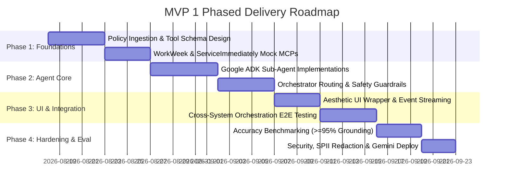

# HR Agentic Solution (MVP 1) — Comprehensive Solution Plan & System Architecture

---

## 1. Executive Summary & Project Context

The **HR Agentic Solution (MVP 1)** is an enterprise-grade, AI-driven multi-agent virtual assistant designed to provide employees with frictionless, conversational self-service. By bridging core enterprise platforms—**WorkWeek (HCM)**, **ServiceImmediately (ITSM)**, and internal **HR Policy Repositories**—the system eliminates manual context switching, deflects routine helpdesk inquiries, and orchestrates complex multi-step cross-system workflows.

### Key Objectives (BRD Aligned):
- **Deflect Tier 1 HR/IT Queries**: Target $\ge 40\%$ deflection of routine inquiries within 6 months through grounded policy retrieval.
- **Self-Service Transactions**: Enable direct leave balance checks, leave submissions, contact updates, and ticket lifecycle tracking via natural language.
- **Cross-System Orchestration**: Validate end-to-end multi-agent execution across policies, HCM, and ITSM (e.g., Medical Leave, Equipment Procurement, Relocation).
- **Enterprise AI Governance**: Zero-trust execution, 0% policy hallucinations, strict role-based data isolation, SPII redaction, and deterministic guardrails.

---

## 2. Target System Architecture

The solution uses a decoupled architecture where a lightweight, visually engaging UI wrapper interfaces with a **Google ADK (Agent Development Kit)** multi-agent runtime. The agents interact with enterprise backends through the **Model Context Protocol (MCP)** and direct tool integrations.


### Architectural Layers:

1. **Client / Presentation Layer (Decoupled UI Wrapper)**:
   - Modern, responsive web chat interface built with animated micro-interactions and high-contrast accessible color themes.
   - Fully decoupled from the backend; communicates via REST API (`/api/chat`) and Server-Sent Events (SSE) or WebSockets.
   - Dual-deployment capability: Can run standalone or be embedded directly into **Gemini Enterprise**.

2. **Agent Orchestration Layer (Google ADK)**:
   - **Central Orchestrator Agent (`hr_orchestrator`)**: Analyzes intent, manages conversation state, performs safety checks, and coordinates delegation across domain specialists.
   - **Specialized Sub-Agents**:
     - **HR Policy Specialist Agent (`policy_agent`)**
     - **WorkWeek HCM Specialist Agent (`hcm_agent`)**
     - **ServiceImmediately ITSM Specialist Agent (`itsm_agent`)**

3. **Integration & Tools Layer (Model Context Protocol - MCP)**:
   - Standardized MCP server interfaces exposing structured tools with strict schema validation, input sanitation, and response formatting.
   - Enforces transaction integrity, parameter bounds, and audit logging.

4. **Enterprise Backend Layer (MVP 1 Target Systems)**:
   - **HR Policy Knowledge Base**: Curated policies (PDFs, Markdown) indexed for semantic retrieval.
   - **WorkWeek HCM**: Core HR system for profiles, leave accruals, and PTO submissions.
   - **ServiceImmediately ITSM**: IT Service Management platform for incident logging, comment timelines, and status lifecycle management.

---

## 3. Multi-Agent System Design (Google ADK)

The multi-agent system is built using the **Google ADK (`google.adk.agents.LlmAgent`)** framework. Rather than relying on a single monolithic prompt, tasks are distributed to domain-specific sub-agents configured with specialized instructions and isolated toolsets.

```
                  ┌─────────────────────────────────────┐
                  │    Main Orchestrator Agent          │
                  │       (hr_orchestrator)             │
                  │  • Intent Detection & Routing       │
                  │  • Context & Memory Management      │
                  │  • Multi-Agent Chain Coordination   │
                  └──────────────────┬──────────────────┘
                                     │
         ┌───────────────────────────┼───────────────────────────┐
         ▼                           ▼                           ▼
┌──────────────────┐       ┌──────────────────┐       ┌──────────────────┐
│  Policy Agent    │       │  WorkWeek HCM    │       │ ServiceImmediately│
│ (policy_agent)   │       │     Agent        │       │   ITSM Agent     │
│                  │       │  (hcm_agent)     │       │  (itsm_agent)    │
│ • Policy RAG     │       │ • Profile Lookup │       │ • Ticket Creation│
│ • Citation Engine│       │ • PTO Balances   │       │ • Status Tracking│
│ • Domain Bounds  │       │ • Leave Booking  │       │ • State Machine  │
└──────────────────┘       └──────────────────┘       └──────────────────┘
```

### Agent Roles & Configurations:

#### A. Main Orchestrator Agent (`hr_orchestrator`)
- **Role**: Entry point for all user interactions.
- **Model**: `gemini-2.5-pro`
- **Responsibilities**:
  - Validates user input against safety filters and prompt injection boundaries (FR-1.3).
  - Routes single-domain queries directly to the appropriate specialist sub-agent.
  - Decomposes multi-intent cross-system requests into sequential sub-agent calls, maintaining state across the execution chain.
  - Synthesizes specialist outputs into an employee-friendly, unified response.

#### B. HR Policy Specialist Agent (`policy_agent`)
- **Role**: Answers inquiries regarding company policies, benefits, guidelines, and compliance perimeters.
- **Model**: `gemini-2.5-pro`
- **Instruction Perimeters**:
  - Grounded strictly in retrieved policy chunks; explicitly declines out-of-scope or unverified questions (0% hallucination mandate).
  - Mandatory citation inclusion: Returns exact document titles, section headers, and deep-link URLs (FR-5.3).
  - Refuses general non-HR questions (coding, creative writing, personal advice).

#### C. WorkWeek HCM Specialist Agent (`hcm_agent`)
- **Role**: Manages employee profile information and leave transactions.
- **Model**: `gemini-2.5-pro`
- **Instruction Perimeters**:
  - Always verifies real-time PTO balance before submitting leave requests (FR-3.4).
  - Enforces chronological validity: `start_date <= end_date` and forbids past-dated requests.
  - Enforces balance limits: Blocks requests where `requested_days > remaining_accrual`.
  - Enforces syntax validation on contact updates (email, phone, address).

#### D. ServiceImmediately ITSM Specialist Agent (`itsm_agent`)
- **Role**: Manages IT and HR service desk incident tickets.
- **Model**: `gemini-2.5-pro`
- **Instruction Perimeters**:
  - Enforces valid ticket status transitions (`New` $\rightarrow$ `In Progress` $\rightarrow$ `Resolved` $\rightarrow$ `Closed`). Blocks direct `New` $\rightarrow$ `Closed` jumps.
  - Validates priority levels (`1 - Critical`, `2 - High`, `3 - Moderate`, `4 - Low`) against incident severity rules.
  - Appends comments and tracks ticket timelines with explicit origin tagging (FR-4.1).

---

## 4. Tools & MCP Integration Layer

The integration layer wraps backend APIs inside **Model Context Protocol (MCP)** compliant tools, providing structured JSON schemas and robust error handling.

### Tool Specification Catalog:

| Tool Name | Sub-Agent | Input Parameters | Output / Action | Guardrails & Validations |
| :--- | :--- | :--- | :--- | :--- |
| `retrieve_policy_docs` | `policy_agent` | `query: str`, `domain_filter: str` | Top-K grounded chunks with source metadata | Strict similarity threshold; filters irrelevant content |
| `retrieve_employee_profile` | `hcm_agent` | `employee_id: str` | JSON profile: department, manager, contact, hire date | Scoped to authenticated user token; no cross-user access |
| `query_time_off_balances` | `hcm_agent` | `employee_id: str` | Vacation & Sick: accrued, used, remaining | Live fetch on every query; dynamic cache bypass |
| `submit_leave_request` | `hcm_agent` | `employee_id`, `start_date`, `end_date`, `leave_type`, `days` | Success/Failure status, updated balance | Balance check, date chronology check ($Start \le End$) |
| `update_contact_information`| `hcm_agent` | `employee_id`, `address`, `phone_number` | Update status confirmation | Regex syntax checks on phone/email; SPII audit masking |
| `query_ticket_details` | `itsm_agent` | `ticket_id: str` | Priority, category, status, assignee, comments timeline | Verifies ticket existence; returns clean history |
| `create_incident_ticket` | `itsm_agent` | `requestor_id`, `category`, `short_desc`, `priority` | New Ticket ID (e.g. `INC123456`) | Priority validation; duplicate detection in quick succession |
| `post_ticket_comment` | `itsm_agent` | `ticket_id`, `user_id`, `comment` | Confirmation of added note | Tags automation source; masks SPII in comment body |
| `update_ticket_status` | `itsm_agent` | `ticket_id`, `new_status`, `resolution_notes` | Status update confirmation | Enforces strict lifecycle state transition rules |

---

## 5. Cross-System Orchestration Flow


### Cross-System Use Cases Walkthrough:

#### Use Case 2.1: Equipment Procurement (Remote Work Policy + HCM + ITSM)
1. **User Prompt**: *"I read the remote work policy and saw I'm eligible for a home office monitor. Can you verify my status and order one for me?"*
2. **Step 1 (`policy_agent`)**: Queries `remote_work_policy.pdf`, extracts home office monitor eligibility criteria (must be full-time remote).
3. **Step 2 (`hcm_agent`)**: Calls `retrieve_employee_profile(emp_001)` to verify work location and shipping address.
4. **Step 3 (`itsm_agent`)**: Calls `create_incident_ticket(category="Hardware", priority="3 - Moderate", short_desc="Home Office Monitor Order - emp_001")` including shipping details.
5. **Step 4 (Synthesis)**: Orchestrator presents policy quote, confirmed shipping address, and the generated Ticket ID.

#### Use Case 2.2: Short-Term Medical Leave (Policy + Leave Booking + Ticket Routing)
1. **User Prompt**: *"I need to take short-term medical leave starting next Monday. What is the process and can you set it up?"*
2. **Step 1 (`policy_agent`)**: Retrieves medical leave policy guidelines (outpatient vs. hospitalization allowance).
3. **Step 2 (`hcm_agent`)**: Calls `query_time_off_balances`, verifies sick balance, then calls `submit_leave_request(start_date="2026-08-24", end_date="2026-08-28", leave_type="Sick", days=5)`.
4. **Step 3 (`itsm_agent`)**: Calls `create_incident_ticket(category="Access", short_desc="Route emp_001 incoming emails to manager during medical leave")`.
5. **Step 4 (Synthesis)**: Orchestrator confirms leave approval, remaining balance, and IT delegation ticket status.

#### Use Case 2.3: International Office Relocation (Policy + Contact Update + Facility Badge)
1. **User Prompt**: *"I'm transferring to London next month. Can you tell me the relocation allowance, update my record, and get my building access sorted?"*
2. **Step 1 (`policy_agent`)**: Returns the London relocation tier allowance.
3. **Step 2 (`hcm_agent`)**: Prompts and updates employee record with new London address.
4. **Step 3 (`itsm_agent`)**: Opens a facilities ticket for a London building security badge.

---

## 6. Guardrails, AI Governance & Non-Functional Compliance

```
User Prompt ──► [Input Guardrail: Prompt Injection / SPII Check]
                      │ (Passed)
                      ▼
               [ADK Orchestrator & Sub-Agents]
                      │
                      ▼
               [MCP Tools: Schema & State Validation]
                      │
                      ▼
         [Output Guardrail: Grounding & Hallucination Scan] ──► Render to UI
```

### Governance Controls Matrix:
- **Zero Hallucinations (NFR-3.1)**: Model answers are strictly constrained to tool responses. If context is missing, the agent explicitly replies with a graceful fallback.
- **Safety & Injection Defense (FR-1.3, NFR-1.1)**: Inputs are screened against jailbreak patterns, prompt leaks, and toxic phrases before reaching sub-agents ($< 300\text{ms}$ latency overhead).
- **SPII Redaction (FR-1.4)**: National IDs, credit card numbers, and private passwords are automatically masked (`[REDACTED]`) in session logs and ticket comments.
- **Deterministic State Machines**: Leave balances cannot become negative; closed tickets cannot be directly commented on or re-opened without authorization.
- **Performance & Latency (NFR-2.1)**: Response generation starts in $< 10.0\text{s}$; async background execution ensures multi-system tool calls don't freeze the conversational turn.

---

## 7. Visually Aesthetic UI Wrapper Specifications

The UI wrapper is designed to deliver an intuitive, delightful employee experience while remaining completely decoupled from the agent backend.

```
┌─────────────────────────────────────────────────────────┐
│  🤖 HR Assistant                  ● Online (Ready)     │
│  Ask about policies, submit leave, or manage IT tickets │
├─────────────────────────────────────────────────────────┤
│                                                         │
│  🤖 Hello! How can I help you today?                    │
│                                                         │
│                             👤 Can you check my PTO?    │
│                                                         │
│  🤖 You currently have:                                 │
│     • Vacation: 15 days remaining                       │
│     • Sick: 8 days remaining                            │
│                                                         │
│  🤖 [Thinking: Querying WorkWeek MCP...] ◌ ◌ ◌          │
│                                                         │
├─────────────────────────────────────────────────────────┤
│  [ Type your request here...                ] [ ➤ Send ]│
└─────────────────────────────────────────────────────────┘
```

### UI Features & Design System:
1. **Color Palette & Visuals**:
   - Primary Header Gradient: Vibrant Indigo to Bright Sky Blue (`#6B46C1` $\rightarrow$ `#3182CE`).
   - Background: Soft modern slate (`#F4F6F8`) with crisp card elevation and shadows (`0 10px 40px rgba(0,0,0,0.1)`).
   - Chat Bubbles: High-contrast blue for User (`#3182CE`), clean neutral slate for Assistant (`#EDF2F7`).
2. **Micro-Animations & Visual Feedback**:
   - **Pulsing Status Ring**: Real-time heartbeat animation on the agent status indicator (`#48BB78`).
   - **Bouncy Thinking Dots**: Smooth 3-dot bounce animation displayed during multi-agent asynchronous processing.
   - **Slide-in Message Transitions**: Messages glide in with subtle vertical translation and opacity fade.
3. **Decoupling & Dual Deployment**:
   - Standalone deployment via lightweight web server (e.g. FastAPI / Nginx serving static assets).
   - Seamless embedding as an extension tab or widget inside **Gemini Enterprise**.
   - Pluggable API contract: Interacts strictly via standard JSON endpoints (`POST /api/chat`, `GET /api/health`).

---

## 8. Phased Implementation Roadmap



### Verification & Testing Criteria:
1. **Policy Benchmark Eval**: Run automated evaluation suite across 50+ policy test prompts to enforce $\ge 95\%$ grounding accuracy and $0\%$ hallucinations.
2. **Transaction Integrity Tests**: Verify that attempting to request 25 vacation days when only 15 remain is rejected with a clear explanation.
3. **Cross-System Chain Verification**: Execute end-to-end simulation of Use Cases 2.1, 2.2, and 2.3, verifying that state is preserved across all sub-agent steps.
