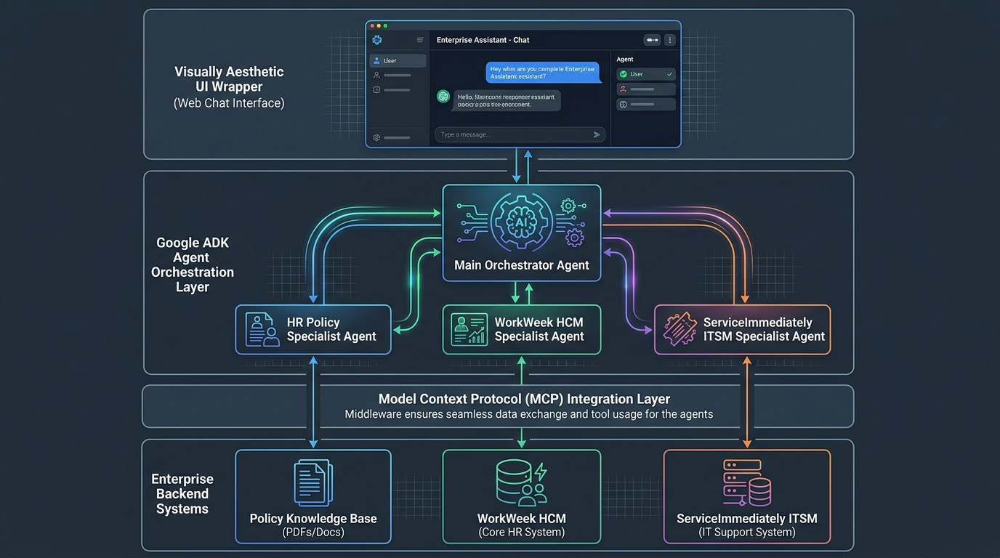
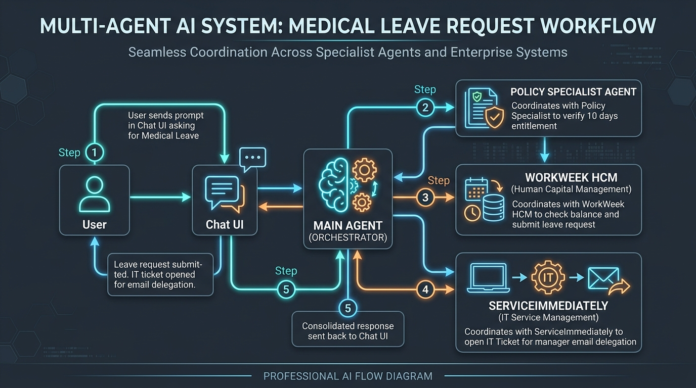

# 🤖 HR Agentic Solution (Team 12) — Enterprise Virtual Assistant

An enterprise-grade, multi-agent virtual assistant designed to provide employees with instantaneous, conversational self-service. Built on **Google ADK (Agent Development Kit)** with Gemini models following the **[BMAD Method (Breakthrough Method for Agile AI-Driven Development)](BMAD_METHODOLOGY.md)**, this solution orchestrates workflows across **WorkWeek (HCM)**, **ServiceImmediately (ITSM)**, and company **HR Policy Knowledge Bases** using the **Model Context Protocol (MCP)**.

[](https://github.com/bmad-code-org/BMAD-METHOD)
[](https://github.com/google/adk)
[](https://ai.google.dev/)

---

## 🏛️ System Architecture



### Architecture Highlights:
- **Centralized Orchestrator (`hr_orchestrator`)**: Performs intent detection, multi-turn state management, safety guardrails, and cross-system task delegation.
- **HR Policy Specialist (`policy_specialist`)**: RAG-powered agent strictly grounded in company policy documents with deep-link source citations.
- **WorkWeek HCM Specialist (`hcm_specialist`)**: Manages employee profiles, contact updates, and leave balance validation/submissions.
- **ServiceImmediately ITSM Specialist (`itsm_specialist`)**: Manages support tickets, activity comment logs, and lifecycle state machines.
- **FastMCP Integration Layer**: Connects statelessly over Streamable HTTP using custom `X-MCP-Token` headers for Google Frontend (GFE) compliance.

---

## 🔄 End-to-End Cross-System Flow



### Example: Short-Term Medical Leave Workflow (Use Case 2.2)
1. **User Prompt**: *"I need to take short-term medical leave starting next Monday. Can you check the policy and set it up for me?"*
2. **Step 1 (Policy)**: `policy_specialist` retrieves medical leave entitlement rules (10 days allowance) and flags the requirement to route email access to the manager.
3. **Step 2 (HCM Leave)**: `hcm_specialist` queries accrued leave balances and submits the leave request in WorkWeek.
4. **Step 3 (ITSM Ticket)**: `itsm_specialist` opens an IT incident ticket in ServiceImmediately to route user email to the manager during leave.
5. **Step 4 (Synthesis)**: `hr_orchestrator` consolidates all actions into a unified, friendly response with leave confirmation and Ticket ID.

---

## 🚀 Quick Start & Setup

### Prerequisites
- Python $\ge$ 3.10
- `uv` (recommended) or `pip`
- Google ADK (`google-adk`) installed

### 1. Clone the Repository
```bash
git clone https://github.com/zuhaibp656/project_elevate_team_12.git
cd project_elevate_team_12
```

### 2. Configure Environment Variables
Copy the example environment file and verify your tokens:
```bash
cp .env.example .env
```
Inside `.env`:
```env
MCP_TOKEN=mcp_CsoiJPHj_FGICu8pf8aFJLIuPc4Kt4AXeOLWyUmwHxQ
MOCK_SAAS_BASE_URL=https://mock-saas.aishprabhat.demo.altostrat.com
GEMINI_MODEL=gemini-2.5-flash
```

---

## 💻 Running & Testing

You can use the included `deploy.sh` script to test and launch the system:

### Option A: ADK Web View UI (Browser Interface)
Launch the interactive web UI provided by Google ADK:
```bash
./deploy.sh --web
# or directly via:
uv run adk web . --port 8088
```
> Open `http://localhost:8088` in your browser and select **`agents`** to interact with the multi-agent system in real time.

---

### Option B: Interactive Terminal Chat (CLI Mode)
Talk to the multi-agent orchestrator directly in your terminal:
```bash
./deploy.sh --cli
# or directly via:
python3 -m agents.orchestrator --interactive
```

---

### Option C: Single Query Execution
Run a one-off query through the orchestrator:
```bash
./deploy.sh --query "How many days of paid outpatient sick leave do I get?"
```

---

### Option D: Test MCP Endpoint Connectivity
Verify authentication and tool discovery against the live mock SaaS portal:
```bash
./deploy.sh --test
```

---

## 🧪 Testing & Verification Prompts
For a complete test suite covering Policy Q&A, WorkWeek HCM, ServiceImmediately ITSM, and Multi-Agent Cross-System Chaining (Medical Leave, Relocation, Hardware), see:
👉 **[TESTING_GUIDE.md](TESTING_GUIDE.md)**

---

## 📂 Project Structure

```
project_elevate_team_12/
├── agents/
│   ├── __init__.py
│   ├── agent.py                  # Entrypoint alias for ADK Web discovery
│   ├── config.py                 # Configuration (Model, Base URL, MCP Token)
│   ├── prompts.py                # BRD-aligned prompts with strict guardrails
│   ├── orchestrator.py           # Main Orchestrator and multi-agent runner
│   └── subagents/
│       ├── __init__.py
│       ├── policy_subagent.py    # Policy Specialist agent
│       ├── hcm_subagent.py       # WorkWeek HCM Specialist agent
│       └── itsm_subagent.py      # ServiceImmediately ITSM Specialist agent
├── tools/
│   ├── __init__.py
│   ├── mcp_toolsets.py           # FastMCP Streamable HTTP toolsets
│   ├── policy_tool.py            # OKF Policy retrieval tools with citations
│   ├── workweek_tools.py         # WorkWeek HCM API & tool implementations
│   └── serviceimmediately_tools.py # ServiceImmediately ITSM API & tool implementations
├── knowledge/                    # Local Singapore HR policy document repository
├── images/                       # High-resolution architecture & flow diagram images
├── tests/
│   └── test_mcp_connection.py    # Connection verification test suite
├── agents-cli-manifest.yaml      # ADK Web manifest descriptor
├── deploy.sh                     # Automated deployment & execution script
├── Solution_Design_Document.md   # Official Enterprise Solution Design Document (SDD)
├── BMAD_METHODOLOGY.md           # BMAD Agile AI-Driven Development Framework
├── Plan_and_Architecture.md      # Implementation plan and architecture
├── TESTING_GUIDE.md              # Complete test prompts & verification suite
└── README.md                     # Project documentation
```

---

## 🛡️ Guardrails & Enterprise Compliance

- **0% Policy Hallucination (FR-5.2)**: Answers are strictly constrained to retrieved policy context; out-of-scope queries are explicitly declined with graceful explanations.
- **Mandatory Source Citations (FR-5.3)**: Every policy answer includes clickable citations to the exact section and document used.
- **Balance & Chronological Validity (FR-3.3)**: Prevents leave overdrafts and validates chronological date bounds ($Start \le End$, no past dates).
- **ITSM State Machine (FR-4.3)**: Enforces valid lifecycle transitions (`New` $\rightarrow$ `In Progress` $\rightarrow$ `Resolved` $\rightarrow$ `Closed`) and blocks invalid jumps.
- **GFE-Safe Authentication**: Transmits Personal Access Tokens via `X-MCP-Token` headers to ensure uninterrupted Streamable HTTP tool execution.
