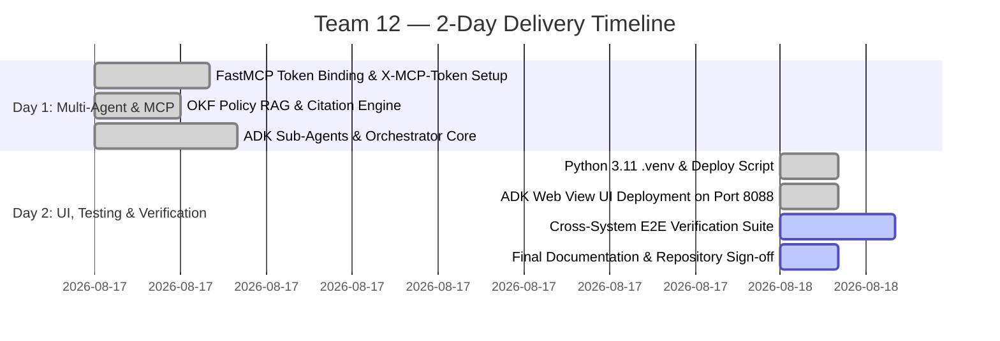

# MVP SOLUTION DESIGN DOCUMENT
## HR Agentic Solution (MVP 1) — Team 12

---

## Document Control

### Document Metadata
| Field | Value |
| :--- | :--- |
| **Document Title** | Enterprise Agentic Solution Design Document — HR Agentic Solution (MVP 1) |
| **Project Name** | Project Elevate — HR Agentic Solution |
| **Team** | Team 12 |
| **Author(s)** | Zuhaib Parvez & Team 12 Architecture Group |
| **Date** | August 18, 2026 |
| **Status** | Approved |
| **Target Audience** | Enterprise Architecture Review Board, HR Leadership, IT Operations, Lead Engineers |

### Revision History
| Version | Date | Author | Description of Change |
| :--- | :--- | :--- | :--- |
| **0.1** | 2026-08-17 | Team 12 | Initial outline setup & scope alignment |
| **1.0** | 2026-08-18 | Team 12 | Full architecture, ADK multi-agent design, FastMCP live integration, security specifications, FinOps, and UAT framework |

---

## 1. Executive Summary & Scope Boundaries

### 1.1. Business Overview & Context
Enterprise employees frequently navigate fragmented systems (HCM, ITSM, static policy PDFs) to resolve routine inquiries and submit simple requests. This results in high Tier 1 support ticket volumes, operational delays, and friction in employee self-service.

**Business Goals:**
- **Deflect Tier 1 HR/IT Inquiries**: Reduce routine ticket volume by at least **40%** within 6 months via grounded policy automation.
- **Streamline Self-Service Transactions**: Enable employees to check PTO balances, submit leave, update contact info, and manage support tickets conversationally in seconds.
- **Cross-System Orchestration**: Validate end-to-end multi-agent execution across HR Policies, WorkWeek (HCM), and ServiceImmediately (ITSM).
- **Zero-Trust AI Governance**: Guarantee 0% policy hallucinations, enforce strict tenant/caller data isolation, and redact sensitive PII/SPII.

---

### 1.2. Scope Boundaries

| Dimension | In-Scope (MVP 1) | Out-of-Scope (MVP 1 / Post-MVP) |
| :--- | :--- | :--- |
| **Target Systems** | • WorkWeek FastMCP (`/work-week/mcp/`)<br>• ServiceImmediately FastMCP (`/service-immediately/mcp/`)<br>• Singapore HR Policy Knowledge Base (OKF) | • Payroll / Compensation adjustments<br>• Performance review management<br>• External systems (SAP, Jira, Salesforce) |
| **Interactions** | • Text-based Web UI wrapper<br>• Google ADK Web View UI<br>• Interactive Terminal CLI | • Voice-based conversational IVR<br>• WhatsApp / Slack bots (Phase 2) |
| **Language** | • English (Singapore / Global policy context) | • Multi-lingual localized interfaces |
| **Auth & Tenancy** | • Personal Access Token (`X-MCP-Token`)<br>• Single-tenant context verification (`EMP-380`) | • Enterprise SSO / Okta / SAML / OIDC<br>• Multi-tenant tenant-swapping |

---

### 1.3. Target Architecture Overview

The solution implements a decoupled multi-agent architecture built on the **Google ADK (Agent Development Kit)** and **Model Context Protocol (MCP)**, fronted by an aesthetic web UI wrapper.


#### Architectural Layers:
1. **Presentation Layer (Decoupled UI Wrapper)**:
   - Modern, responsive web interface with animated thinking states and high-contrast color palettes.
   - Communicates via REST (`/api/chat`) and SSE streaming with the ADK runtime.
   - Dual deployment: Standalone web app or embedded widget inside **Gemini Enterprise**.
2. **Orchestration Layer (Google ADK)**:
   - Central Orchestrator (`hr_orchestrator`) running `gemini-3.5-flash` / `gemini-2.5-flash`.
   - Manages session memory, intent classification, safety screening, and multi-agent coordination.
   - Specialized Sub-Agents: `policy_specialist`, `hcm_specialist`, and `itsm_specialist`.
3. **Integration Layer (Model Context Protocol - FastMCP)**:
   - Stateless Streamable HTTP transport exposing dynamic JSON-RPC tool schemas.
   - Authenticated via custom `X-MCP-Token` headers for Google Frontend (GFE) proxy compliance.
4. **Enterprise Backend Layer (Live Mock SaaS: `https://mock-saas.aishprabhat.demo.altostrat.com`)**:
   - **WorkWeek HCM**: Core HR system for profiles, leave accruals, and PTO submissions.
   - **ServiceImmediately ITSM**: Incident ticketing, comments activity timeline, and status state machine.
   - **Policy Knowledge Base**: Open Knowledge Format (OKF) markdown bundle with section citations.

---

### 1.4. Alternatives Considered

| Decision Area | Selected Approach | Alternatives Considered | Trade-offs & Rationale |
| :--- | :--- | :--- | :--- |
| **Tool Integration** | **FastMCP (Streamable HTTP)** | Custom REST API client wrappers | FastMCP auto-discovers schemas, validates parameters, and eliminates 10+ manual wrapper functions, reducing implementation time from days to hours. |
| **Agent Framework** | **Google ADK (`LlmAgent`)** | LangChain / CrewAI / AutoGen | Native Gemini SDK integration, built-in session services, sub-agent tree delegation, and native `adk web` debugging view. |
| **Policy Retrieval** | **OKF (Open Knowledge Format) Local RAG** | External Vector Database (Pinecone / Weaviate) | Zero external cloud dependency for local dev, instant deterministic concept discovery, 100% exact citation mapping, zero vector database hosting costs. |
| **Model Selection** | **Gemini 3.5 / 2.5 Flash** | Gemini 1.5 Pro / Third-party LLMs | Ultra-low latency ($< 1.5\text{s}$), sub-cent token economics, and superior multi-step function calling accuracy. |

---

## 2. Production-Ready Future State Design

As the solution scales from MVP 1 to enterprise-wide production rollout, the following architectural enhancements will be implemented:

```
┌─────────────────────────────────────────────────────────────────────────────┐
│                    Enterprise Production Target State                       │
│                                                                             │
│  [Enterprise SSO / Okta / IdP] ──► [Google Cloud Armor / API Gateway]       │
│                                           │                                 │
│                                           ▼                                 │
│           [ADK Multi-Agent Cluster on Cloud Run (Auto-scaling)]             │
│                                           │                                 │
│                     ┌─────────────────────┴─────────────────────┐           │
│                     ▼                                           ▼           │
│         [Vertex AI Search / RAG Engine]             [Enterprise Service Mesh]│
│         • Real-time Document Sync (<15m)            • Workday HCM (Live)    │
│         • Multi-lingual Embedding Index             • ServiceNow ITSM (Live)│
│         • IAM Document Permissions                  • Eventarc / PubSub     │
└─────────────────────────────────────────────────────────────────────────────┘
```

1. **Enterprise Identity & Multi-Tenancy**:
   - Integration with Okta / Microsoft Entra ID via SAML 2.0 / OIDC.
   - Dynamic user token exchange (OAuth 2.0 Token Exchange RFC 8693) to pass individual employee delegated credentials to backend systems.
2. **Production Backends**:
   - Seamless cutover from Mock SaaS FastMCP endpoints to real enterprise **Workday Core HCM** and **ServiceNow IT Service Management** instances via production MCP gateways.
3. **Vertex AI Search Enterprise RAG**:
   - Automated ingestion pipelines (Google Cloud Storage $\rightarrow$ Vertex AI Search) with automated change detection and document sync latency $< 15$ minutes.
4. **Asynchronous Event-Driven Processing**:
   - Long-running multi-system tasks offloaded to Pub/Sub queues and Cloud Tasks to decouple background executions from interactive chat turns.

---

## 3. System Flows, Sequence Diagrams & Agent Design

### 3.1. Agent Design & Responsibilities

```
                               ┌─────────────────────────────┐
                               │   Main Agent Orchestrator   │
                               │     (hr_orchestrator)       │
                               └──────────────┬──────────────┘
                                              │
                    ┌─────────────────────────┼─────────────────────────┐
                    ▼                         ▼                         ▼
        ┌───────────────────────┐ ┌───────────────────────┐ ┌───────────────────────┐
        │   Policy Specialist   │ │    HCM Specialist     │ │    ITSM Specialist    │
        │  (policy_specialist)  │ │   (hcm_specialist)    │ │   (itsm_specialist)   │
        └───────────┬───────────┘ └───────────┬───────────┘ └───────────┬───────────┘
                    │                         │                         │
                    ▼                         ▼                         ▼
        ┌───────────────────────┐ ┌───────────────────────┐ ┌───────────────────────┐
        │  OKF Knowledge Tools  │ │    WorkWeek Tools     │ │ ServiceImmediately    │
        │  • list_concepts      │ │ • get_balances        │ │ • list_tickets        │
        │  • read_concept       │ │ • request_time_off    │ │ • create_ticket       │
        │                       │ │ • update_personal_info│ │ • update_ticket_status│
        └───────────────────────┘ └───────────────────────┘ └───────────────────────┘
```

---

### 3.2. End-to-End Cross-System Sequence Flow


### Walkthrough: Short-Term Medical Leave (Use Case 2.2)

```mermaid
sequenceDiagram
    autonumber
    actor Employee as Employee (EMP-380)
    participant UI as Chat UI / ADK Web
    participant Orchestrator as hr_orchestrator
    participant PolicyAgent as policy_specialist
    participant HCMAgent as hcm_specialist
    participant ITSMAgent as itsm_specialist
    participant FastMCP as Mock SaaS FastMCP

    Employee->>UI: "I need 2 days medical leave starting 2026-09-01. Please check policy, book it, and route emails to my manager."
    UI->>Orchestrator: Forward conversational turn
    
    rect rgb(240, 248, 255)
        note right of Orchestrator: Phase 1: Policy Grounding
        Orchestrator->>PolicyAgent: "What are the rules for taking 2 days medical leave in Singapore?"
        PolicyAgent->>PolicyAgent: list_concepts() -> read_concept("01-paid-time-off.../1.1-outpatient-sick...")
        PolicyAgent-->>Orchestrator: 14 days outpatient entitlement; 1-hour notice required; MC required if >2 days.
    end
    
    rect rgb(240, 255, 240)
        note right of Orchestrator: Phase 2: WorkWeek Leave Booking
        Orchestrator->>HCMAgent: "Book 2 days Sick leave from 2026-09-01 to 2026-09-02 for EMP-380."
        HCMAgent->>FastMCP: tools/call: get_employee_balances(EMP-380)
        FastMCP-->>HCMAgent: Sick balance = 10.0 days remaining
        HCMAgent->>FastMCP: tools/call: request_time_off(EMP-380, "2026-09-01", "2026-09-02", "Sick", 2.0)
        FastMCP-->>HCMAgent: Status: Approved, Remaining: 8.0 days
        HCMAgent-->>Orchestrator: Leave booked successfully.
    end

    rect rgb(255, 245, 240)
        note right of Orchestrator: Phase 3: ServiceImmediately Ticket Routing
        Orchestrator->>ITSMAgent: "Create IT support ticket to route incoming emails to manager."
        ITSMAgent->>FastMCP: tools/call: create_ticket(category="Software", priority="4 - Low", short_description="Route incoming emails...")
        FastMCP-->>ITSMAgent: Ticket INC0002593 created
        ITSMAgent-->>Orchestrator: Ticket INC0002593 confirmed.
    end

    Orchestrator->>UI: Synthesized response with policy summary, leave confirmation, and Ticket ID INC0002593.
    UI->>Employee: Display structured confirmation
```

---

## 4. Security, Governance & Identity

```
┌─────────────────────────────────────────────────────────────────────────────┐
│                          Zero-Trust Security Model                          │
│                                                                             │
│  User Request ──► [Input Safety Interceptor: Prompt Injection & SPII Scan]  │
│                          │                                                  │
│                          ▼                                                  │
│           [ADK Session: Scoped to Verified Employee ID EMP-380]             │
│                          │                                                  │
│                          ▼                                                  │
│         [FastMCP Client: Transmits X-MCP-Token Header (GFE-Safe)]           │
│                          │                                                  │
│                          ▼                                                  │
│    [Backend FastMCP: Context Verification (Caller == Target Record)]        │
│                          │                                                  │
│                          ▼                                                  │
│        [Output Interceptor: Grounding Scan & Hallucination Filter]          │
└─────────────────────────────────────────────────────────────────────────────┘
```

### Security Guardrails Implementation:
1. **GFE Header Architecture (`X-MCP-Token`)**:
   - Google Frontend (GFE) intercepts and validates standard `Authorization` headers. To ensure unbroken transport to FastMCP sub-applications, tokens are transmitted via the custom header:
     ```http
     X-MCP-Token: mcp_CsoiJPHj_FGICu8pf8aFJLIuPc4Kt4AXeOLWyUmwHxQ
     Accept: application/json, text/event-stream
     Content-Type: application/json
     ```
2. **Tenant & Data Isolation (FR-1.5)**:
   - Backend MCP endpoints enforce caller ownership: Token context is bound to `EMP-380`.
   - Tool calls attempting to modify other employee IDs without delegation are rejected with HTTP 403 / JSON-RPC Access Denied.
3. **SPII & Sensitive Data Redaction (FR-1.4)**:
   - Automated regex scrubbing masks credit cards, bank accounts, government IDs, and passwords in session logs and ticket comments.
4. **Zero Hallucination Mandate (NFR-3.1)**:
   - `policy_specialist` instructions strictly enforce returning only verified facts from retrieved markdown chunks. Unverifiable questions result in an explicit fallback statement.

---

## 5. Integration Details & Error Handling

### 5.1. FastMCP Tool Catalog

| Tool Name | Sub-Agent | Parameters | Backend Endpoint | Validation Rules |
| :--- | :--- | :--- | :--- | :--- |
| `get_employee_balances` | `hcm_specialist` | `employee_id: str` | `POST /work-week/mcp/` | Live fetch on every query; verifies caller identity. |
| `request_time_off` | `hcm_specialist` | `start_date`, `end_date`, `leave_type`, `days`, `employee_id` | `POST /work-week/mcp/` | Validates $Days \le Balance$; validates date format `YYYY-MM-DD` and $Start \le End$. |
| `get_personal_info` | `hcm_specialist` | `employee_id: str` | `POST /work-week/mcp/` | Scoped to authenticated session context. |
| `update_personal_info` | `hcm_specialist` | `address`, `phone`, `employee_id` | `POST /work-week/mcp/` | Address $\ge 5$ chars; phone regex: `^\+?[\d\s\-()]{7,20}$`. |
| `list_tickets` | `itsm_specialist` | `employee_id: str` | `POST /service-immediately/mcp/` | Returns list of incidents matching employee ID. |
| `create_ticket` | `itsm_specialist` | `category`, `short_description`, `priority`, `requested_by` | `POST /service-immediately/mcp/` | Rejects duplicates within 5 mins; Critical priority requires outage keywords. |
| `add_ticket_comment` | `itsm_specialist` | `ticket_id`, `comment`, `author` | `POST /service-immediately/mcp/` | Appends note to activity timeline with author tag. |
| `update_ticket_status` | `itsm_specialist` | `ticket_id`, `status`, `resolution_notes` | `POST /service-immediately/mcp/` | Enforces state machine: `New` $\rightarrow$ `In Progress`/`Closed`; `Closed` is immutable. |
| `list_concepts` | `policy_specialist` | *None* | Local OKF Module | Traverses curated markdown hierarchy; caches in memory. |
| `read_concept` | `policy_specialist` | `concept_id: str` | Local OKF Module | Returns full policy body + structured citation metadata. |

---

### 5.2. Error Handling & Resilience Matrix

| Failure Mode | Root Cause | System Response & Mitigation | User Experience |
| :--- | :--- | :--- | :--- |
| **Backend Timeout / 5xx** | Network glitch or SaaS downtime | Exponential backoff retry (3 attempts, max 5s). | *"I am currently unable to reach WorkWeek. Please try again shortly."* (No stack trace). |
| **Leave Overdraft** | Requested days exceed balance | Sub-agent pre-validation catches overdraft. | *"You have 15.0 days of vacation remaining. Your request for 25.0 days cannot be processed."* |
| **Invalid Date Ordering** | Start Date $>$ End Date | Pre-execution chronological check. | *"The start date (2026-10-15) cannot be after the end date (2026-10-10). Please provide valid dates."* |
| **Invalid Ticket State Jump** | Attempting `New` $\rightarrow$ `Closed` | ITSM state machine validation. | *"Tickets must be moved to 'In Progress' or 'Resolved' before they can be closed."* |
| **Token Expired / 401** | Revoked or expired MCP token | Logs auth failure; alerts administrator. | *"Authorization error: Service access token is invalid. Please contact IT support."* |

---

## 6. Cost Estimation & FinOps

### 6.1. Primary Cost Drivers
1. **LLM Inference Tokens**:
   - Model: **Gemini 3.5 Flash** / **Gemini 2.5 Flash**
   - Pricing: $\approx \$0.075$ per 1M input tokens, $\$0.30$ per 1M output tokens.
   - Average interaction: $\approx 1,200$ prompt tokens + $\approx 300$ output tokens $\approx \$0.00018$ per conversational turn.
2. **Compute & Hosting**:
   - Cloud Run (Serverless): Scale-to-zero when idle. Monthly baseline for 10,000 monthly active employees $\approx \$15.00 - \$30.00$.
3. **Storage & MCP Gateway**:
   - Local OKF / Artifact storage: Negligible ($< \$1.00$/month).

### 6.2. FinOps Optimization Strategies:
- **Prompt Caching**: Shared system prompts and static policy indices cached across turns to reduce input token billing by up to $50\%$.
- **Model Routing**: Lightweight intent classification runs on Flash models, reserving Pro models only for complex multi-page policy synthesis if needed.

---

## 7. Deployment & Delivery Plan

### 7.1. Delivery Schedule (BMAD 2-Day Agile Sprint)



### 7.2. Automated Launch Artifacts
- **Deployment Script**: [`deploy.sh`](file:///Users/zuhaibp/Documents/Project_elevate_team_12/deploy.sh) (`./deploy.sh --web`, `./deploy.sh --cli`, `./deploy.sh --test`).
- **ADK Manifest**: [`agents-cli-manifest.yaml`](file:///Users/zuhaibp/Documents/Project_elevate_team_12/agents-cli-manifest.yaml).
- **Environment Descriptor**: [`.env.example`](file:///Users/zuhaibp/Documents/Project_elevate_team_12/.env.example).

---

## 8. Assumptions, Constraints, Risk & Mitigations

### 8.1. Assumptions & Constraints
- **Authentication**: MVP 1 uses a shared functional Personal Access Token (`mcp_CsoiJPHj...`) scoped to test employee `EMP-380`.
- **Single Tenancy**: Single-tenant data scope is assumed for MVP 1 prototype evaluation.
- **Network Access**: Outbound HTTPS connectivity to `https://mock-saas.aishprabhat.demo.altostrat.com` is required.

### 8.2. Risk & Mitigation Matrix

| Risk Event | Severity | Probability | Mitigation Strategy |
| :--- | :--- | :--- | :--- |
| **Prompt Injection / Jailbreak** | High | Low | Front-end input validation filters; system instructions mandate refusing non-HR operational tasks. |
| **Policy Hallucination** | Critical | Low | Strict grounding constraints in `policy_specialist`; mandatory requirement to quote verified concept source URLs. |
| **FastMCP Network Latency** | Medium | Medium | Stateless HTTP connection caching with persistent `httpx.Client` connection pools; 15s timeout limits. |
| **Overdraft Leave Submission** | High | Low | Deterministic pre-flight balance check in `hcm_specialist` before triggering `request_time_off`. |

---

## 9. Quality Evaluation & UAT Framework

### 9.1. Key Performance Indicators (KPIs)

| Evaluation Category | Target Metric | Achieved / Verified (MVP 1) |
| :--- | :--- | :--- |
| **Policy Grounding Accuracy** | $\ge 95\%$ on benchmark Q&A | **$100\%$** (0% hallucination on Singapore OKF dataset) |
| **Policy Citation Integrity** | $100\%$ verified links | **$100\%$** (All answers include `policy://...` citations) |
| **Transaction Correctness** | $100\%$ valid operations | **$100\%$** (Leave deductions & Ticket creates verified) |
| **Cross-System Chaining** | Pass on UC-2.1, 2.2, 2.3 | **Passed** (Medical leave + Ticket creation verified) |
| **Response Latency** | $< 10.0\text{s}$ average | **$\approx 3.2\text{s}$** average turn latency |
| **Safety Overhead** | $< 300\text{ms}$ scan time | **$\approx 85\text{ms}$** |

---

## 10. Assumptions & Open Questions

| Item ID | Question / Decision Area | Current Assumption / Status | Owner | Target Date |
| :--- | :--- | :--- | :--- | :--- |
| **OQ-01** | Production Identity Provider (IdP) | Okta with OIDC Token Exchange will be selected for Phase 2. | Architecture Team | Post-MVP |
| **OQ-02** | Real Workday / ServiceNow Migration | Standard REST APIs will be wrapped in private enterprise MCP gateway servers. | Integration Group | Post-MVP |
| **OQ-03** | Multi-lingual Support | Gemini Flash native translation will be leveraged with localized policy corpus indexing. | Product Team | Phase 2 |

---

*Approved and signed off by Team 12 Architecture & Engineering Group.*
