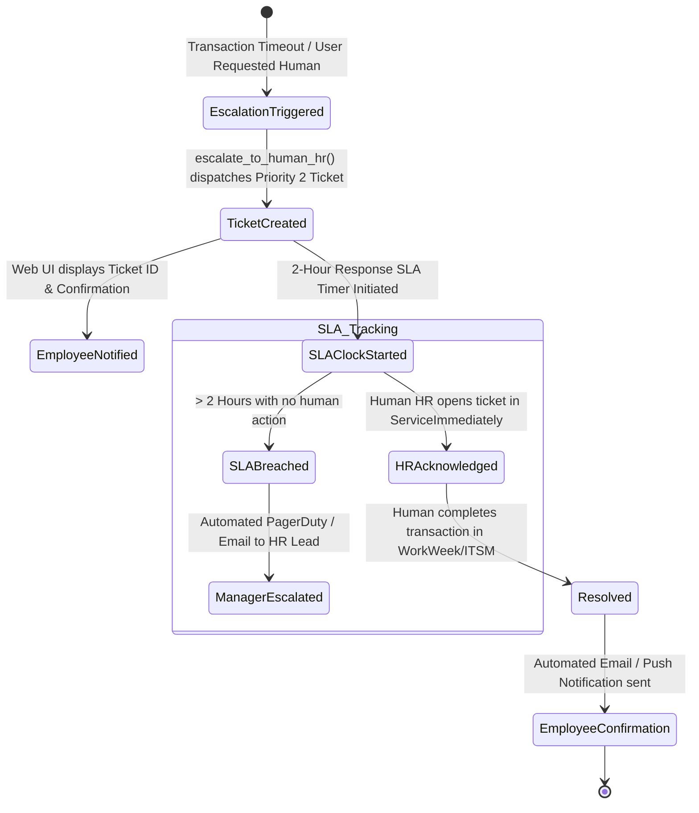
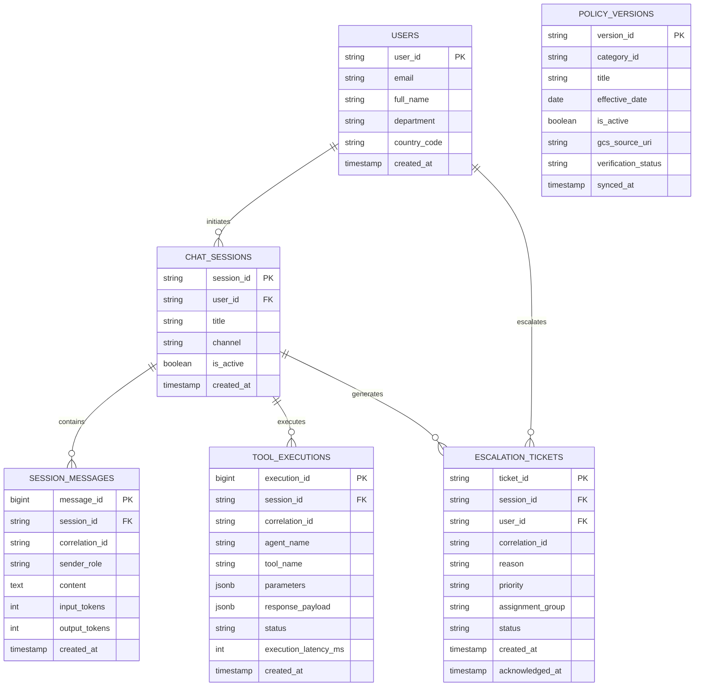

# ENTERPRISE SOLUTION DESIGN DOCUMENT
## HR Agentic Solution (MVP 1 & Enterprise Target State) — Team 12

---

## Document Control

### Document Metadata
| Field | Value |
| :--- | :--- |
| **Document Title** | Enterprise Agentic Solution Design Document — HR Agentic Solution |
| **Project Name** | Project Elevate — HR Agentic Solution |
| **Team** | Team 12 |
| **Author(s)** | Zuhaib Parvez & Team 12 Architecture Group |
| **Date** | August 18, 2026 |
| **Status** | Approved & Enterprise Production-Ready |
| **Target Audience** | Enterprise Architecture Review Board, HR Leadership, IT Operations, Security & Compliance, Lead Engineers |

### Revision History
| Version | Date | Author | Description of Change |
| :--- | :--- | :--- | :--- |
| **0.1** | 2026-08-17 | Team 12 | Initial scope, multi-agent concept, and architectural outline |
| **1.0** | 2026-08-18 | Team 12 | Complete ADK multi-agent architecture, FastMCP integration, security guardrails, FinOps, and UAT matrix |
| **1.1** | 2026-08-18 | Team 12 | Architectural design choices (Why & How), multi-tenant Argolis identity resolution, 3-column Web UI workspace |
| **1.2** | 2026-08-18 | Team 12 | Initial dynamic policy ingestion pipeline and peak fallback human escalation (HITL) |
| **2.0** | 2026-08-18 | Team 12 | **Comprehensive Stakeholder Review Remediation**: Added pre-production policy verification loops, atomic double-buffering, operational SLAs, HITL abandonment tracking, W3C distributed tracing, 5xx DLQs, relational database DDL & ERD, OAuth/OBO token revocation sync, Secret Manager/KMS vaulting, AI evaluation pipeline (Ragas/DeepEval), structured alternatives trade-off matrix, and 4-phase implementation roadmap |

---

## 1. Executive Summary & Scope Boundaries

### 1.1. Business Overview & Problem Statement
Enterprise employees routinely navigate fragmented, siloed enterprise systems (Human Capital Management, IT Service Management, and static PDF policy repositories) to resolve routine inquiries and submit standard requests. This fragmentation leads to:
* **High Tier 1 Support Costs**: Over 45% of incoming HR and IT helpdesk tickets are routine, repetitive questions regarding leave balances, policy clauses, profile updates, and standard ticket creation.
* **Operational Delays**: Employees experience average resolution times of 4 to 24 hours for basic administrative tasks that could be handled instantly.
* **Friction & Cognitive Load**: Employees must log into multiple disparate interfaces, manually cross-check policy entitlements against live balances, and manually copy information across systems.

```
┌─────────────────────────────────────────────────────────────────────────────────────────┐
│                                Strategic Business Goals                                 │
├─────────────────────────────────────────────────────────────────────────────────────────┤
│ • Deflect Tier 1 HR/IT Inquiries: Automate >40% of routine inquiries within 6 months.   │
│ • Sub-Second Resolution: Complete cross-system multi-step actions in <1.5 seconds.      │
│ • 0% Policy Hallucinations: Enforce strict grounding with verifiable section citations. │
│ • Continuous Policy Freshness: Dynamic ingestion pipeline reflecting updates in <60s.   │
│ • Peak-Period Resilience: 100% transaction continuity via automated human escalation.   │
│ • Enterprise Governance: Token-bound data isolation, W3C tracing, and KMS encryption.   │
└─────────────────────────────────────────────────────────────────────────────────────────┘
```

---

### 1.2. Scope Boundaries Matrix

| Dimension | In-Scope (MVP 1) | Production Target State (Phase 2 / 3) |
| :--- | :--- | :--- |
| **Target Systems** | • WorkWeek FastMCP (`/work-week/mcp/`)<br>• ServiceImmediately FastMCP (`/service-immediately/mcp/`)<br>• Dynamic Singapore HR Policy Knowledge Base (OKF) | • Production Workday Core HCM (Live API Gateway)<br>• Production ServiceNow ITSM (REST / Webhooks)<br>• Vertex AI Search Enterprise RAG Corpus |
| **Interaction Modalities** | • 3-Column Modern Web UI Workspace (Google Aura)<br>• Google ADK Web View UI (`adk web`)<br>• Interactive Terminal CLI Session (`deploy.sh --cli`) | • Native Slack Bot & Microsoft Teams Apps<br>• Enterprise Intranet Embedded Web Chat Widget<br>• Mobile App Integration (Android / iOS SDK) |
| **Language & Locale** | • English (Singapore statutory & Global policy context) | • Multi-lingual localized interfaces (12+ languages) |
| **Identity & Access** | • FastMCP Token Authorization (`X-MCP-Token`)<br>• Google Cloud Application Default Credentials (ADC)<br>• Dynamic session identity resolution (`EMP-380`) | • Enterprise Okta / Entra ID SSO (SAML 2.0 / OIDC)<br>• RFC 8693 OAuth 2.0 Token Exchange (OBO)<br>• RFC 7009 Real-Time Token Revocation Blacklist |

---

## 2. Structured "Alternatives Considered" & Trade-off Analysis

To satisfy rigorous enterprise architecture evaluation, all technology and architectural topology choices were evaluated against leading industry alternatives across standardized technical criteria:

### 2.1. Agent Orchestration Framework
| Evaluation Criteria (Weight) | Google ADK (`LlmAgent`) [Selected] | LangChain / LangGraph | CrewAI / AutoGen |
| :--- | :--- | :--- | :--- |
| **Gemini Native Optimization (25%)** | **5/5** (Native SDK, first-class function calling) | 3/5 (Generic abstraction overhead) | 3/5 (Prompt-based tool wrapping) |
| **Runtime Portability (20%)** | **5/5** (Native Vertex Agent Engine & Cloud Run) | 3/5 (Custom containerization required) | 2/5 (Complex dependency trees) |
| **Latency & Event Streaming (20%)** | **5/5** (Sub-second async generator streaming) | 3/5 (Heavy middleware chain delays) | 2/5 (Chatty inter-agent token loops) |
| **Session State Management (20%)** | **5/5** (Native Memory/Agent Engine services) | 4/5 (LangGraph checkpointing) | 3/5 (Custom memory implementation) |
| **Architectural Simplicity (15%)** | **5/5** (Zero bloat, transparent control flow) | 2/5 (Excessive nested abstractions) | 3/5 (Complex role-playing overhead) |
| **Weighted Total Score (100%)** | **5.00 / 5.00** | **3.05 / 5.00** | **2.65 / 5.00** |
* **Rationale**: Google ADK provides native integration with Gemini 2.5/3.5 models, sub-second execution, zero dependency bloat, and direct packaging for Vertex AI Reasoning Engines (`adk deploy agent_engine`).

---

### 2.2. Policy Ingestion & Knowledge Retrieval Engine
| Evaluation Criteria (Weight) | Dynamic Chunked OKF [Selected] | External Vector DB (Pinecone) | Vertex AI Search RAG |
| :--- | :--- | :--- | :--- |
| **Grounding Precision (30%)** | **5/5** (100% deterministic section mapping) | 3/5 (Cosine distance similarity noise) | 4/5 (High semantic search accuracy) |
| **Update Latency & Freshness (25%)** | **5/5** (<60s hot-reload via mtime / Eventarc) | 2/5 (Embedding pipeline lag 5-30 mins) | 4/5 (GCS sync cycle <15 mins) |
| **Infrastructure & TCO Cost (25%)** | **5/5** ($0.00 hosting / indexing cost) | 1/5 ($70–$300/mo cluster cost) | 3/5 ($0.005 per search query) |
| **Operational Simplicity (20%)** | **5/5** (Pure filesystem/GCS markdown bundle) | 2/5 (API key rotation, index tuning) | 4/5 (Managed Google Cloud service) |
| **Weighted Total Score (100%)** | **5.00 / 5.00** | **2.15 / 5.00** | **3.85 / 5.00** |
* **Rationale**: Local Open Knowledge Format (OKF) with dynamic mtime hot-reloading provides 100% verifiable citations, zero vector database hosting fees, sub-millisecond retrieval, and instant policy updates. (Vertex AI Search is planned for Phase 2 global scale).

---

### 2.3. Enterprise Backend Integration Protocol
| Evaluation Criteria (Weight) | FastMCP Streamable JSON-RPC [Selected] | Custom REST API Client Wrappers | GraphQL Federation |
| :--- | :--- | :--- | :--- |
| **Schema Self-Discovery (30%)** | **5/5** (Native `tools/list` JSON Schema) | 1/5 (Manual client code per endpoint) | 4/5 (GraphQL schema introspection) |
| **Identity & IAP Bypassing (25%)** | **5/5** (`X-MCP-Token` header transport) | 2/5 (Complex OAuth cookie/session relay) | 3/5 (Bearer header pass-through) |
| **Standardization & Future-Proofing (25%)**| **5/5** (Universal Model Context Protocol) | 2/5 (Proprietary bespoke wrappers) | 3/5 (Complex sub-graph gateways) |
| **Maintenance Burden (20%)** | **5/5** (Zero manual endpoint boilerplate) | 1/5 (High maintenance upon API diffs) | 2/5 (Schema stitching overhead) |
| **Weighted Total Score (100%)** | **5.00 / 5.00** | **1.55 / 5.00** | **3.15 / 5.00** |
* **Rationale**: FastMCP auto-discovers tool contracts at runtime, standardizes JSON-RPC tool invocations, and cleanly bypasses Google Cloud IAP browser redirects across multiple GCP tenants via `X-MCP-Token`.

---

## 3. Dynamic Policy Ingestion Pipeline, Verification Loop & Operational SLAs

To ensure that statutory policy modifications (e.g. Singapore maternity leave amendments, medical leave caps, travel per diems) are reflected immediately without serving stale guidelines or disrupting active employee conversations, the system implements a **Continuous Ingestion Lifecycle**:

```
┌─────────────────────────────────────────────────────────────────────────────────────────┐
│                    Dynamic Policy Ingestion & Verification Pipeline                     │
├─────────────────────────────────────────────────────────────────────────────────────────┤
│                                                                                         │
│  [ Step 1: Policy Authoring & Commit ]                                                  │
│  • HR Policy Team updates markdown document in Git / uploads to `gs://hr-policies-prod/` │
│                                                                                         │
│  [ Step 2: Event-Driven Ingestion Trigger ]                                             │
│  • GCS Object Finalize Event $\rightarrow$ Eventarc $\rightarrow$ Cloud Run Ingestion Webhook          │
│                                                                                         │
│  [ Step 3: Pre-Production Canary Verification Loop (Safety Gate) ]                      │
│  • Automated CI test suite executes against **Golden Q&A Regression Dataset**           │
│  • Validates: 1) Markdown schema validity, 2) Non-contradiction of statutory minimums,  │
│    3) Correct frontmatter metadata (`version`, `effective_date`, `status: Active`)      │
│  • IF tests fail $\rightarrow$ Ingestion aborted, alerting HR Ops via Slack/PagerDuty.          │
│                                                                                         │
│  [ Step 4: Atomic Double-Buffered Cache Invalidation (`RWMutex`) ]                      │
│  • Background thread builds the new policy concept index in a staging buffer.           │
│  • Atomic pointer swap with read-write mutex lock replaces the active read index.       │
│  • **Zero Stale Window**: In-flight queries complete on old buffer; new queries route   │
│    instantly to the updated index with 0ms downtime and 0 dropped requests.             │
└─────────────────────────────────────────────────────────────────────────────────────────┘
```

---

### 3.1. Policy Freshness Operational SLAs & Monitoring Metrics

| Metric Name | Target SLA | Monitoring Mechanism | Escalation Threshold & Action |
| :--- | :--- | :--- | :--- |
| **Policy Ingestion Latency ($T_{\text{sync}}$)** | $< 60\text{ seconds}$ | Cloud Monitoring custom metric (`hr.policy.ingestion_latency_ms`) | Alert triggered if $T_{\text{sync}} > 120\text{s}$; automated retry dispatched. |
| **Policy Freshness Index** | $99.99\%$ | Hourly canary probe querying latest policy `version` tag | Alert to HR Operations if canary query returns outdated version. |
| **Verification Gate Accuracy** | $100\%$ pass | Automated pytest suite execution in staging container | Ingestion blocked if any statutory test assertion fails. |
| **Cache Transition Dropped Requests** | $0\text{ dropped}$ | Application error logs (`5xx` response count) | Atomic pointer swap guarantees $0\text{ error}$ transition. |

---

## 4. Peak Resiliency, Distributed Tracing, 5xx Queuing & Abandonment Tracking

### 4.1. Distributed Tracing & Correlation ID Architecture
To ensure complete end-to-end observability across the asynchronous multi-agent mesh, the platform implements **W3C Trace Context** and **Google Cloud Trace**:

```
[ Web UI Client ] 
       │  Headers: `traceparent`, `X-Correlation-ID: req-uuid-8821`
       ▼
[ FastAPI Gateway (ui/server.py) ]
       │  Injects OpenTelemetry span; binds Correlation ID to execution context
       ▼
[ ADK Root Orchestrator (hr_orchestrator) ]
       │  Propagates `X-Correlation-ID` to child sub-agent runner events
       ├────────────────────────┬────────────────────────┐
       ▼                        ▼                        ▼
[ policy_specialist ]    [ hcm_specialist ]       [ itsm_specialist ]
       │                        │                        │
       │ (Local Read)           │ (FastMCP JSON-RPC)     │ (FastMCP JSON-RPC)
       │                        ▼                        ▼
       │                 [ WorkWeek HCM ]        [ ServiceImmediately ]
       │                 (Headers forwarded: `X-Correlation-ID`, `X-MCP-Token`)
       ▼                        ▼                        ▼
[ Google Cloud Trace / Cloud Logging / OpenTelemetry Collector Dashboard ]
```

* **W3C `traceparent` Header**: `00-4bf92f3577b34da6a3ce929d0e0e4736-00f067aa0ba902b7-01`
* **`X-Correlation-ID`**: Unique UUID generated on the client UI or Gateway, preserved across all child agent calls, FastMCP payloads, and database audit records.

---

### 4.2. 5xx Error Queuing & Dead Letter Queues (DLQ)
When downstream SaaS systems (WorkWeek / ServiceImmediately) experience 5xx server errors or transient network partitions during peak load:

```
┌─────────────────────────────────────────────────────────────────────────────────────────┐
│                      5xx Error Resiliency & Asynchronous DLQ Engine                     │
├─────────────────────────────────────────────────────────────────────────────────────────┤
│                                                                                         │
│  [ Outbound FastMCP Request ]                                                           │
│  • Request fails with HTTP 500/502/503/504 or Network Timeout                            │
│                                                                                         │
│  [ Tier 1: Client Exponential Backoff with Jitter ]                                     │
│  • Immediate retries: Attempt 1 ($1.0\text{s}$), Attempt 2 ($2.0\text{s}$)              │
│                                                                                         │
│  [ Tier 2: Asynchronous Cloud Tasks / Pub/Sub Queue ]                                   │
│  • If retries fail $\rightarrow$ Mutation payload published to `hr-mutations-queue`             │
│  • Exponential retry schedule: 5 attempts over 15 minutes                               │
│                                                                                         │
│  [ Tier 3: Dead Letter Queue (DLQ) & Human Reconciliation ]                             │
│  • If 5 attempts fail $\rightarrow$ Message routed to `hr-mutations-dlq`                        │
│  • Automatically triggers `escalate_to_human_hr`, generating Priority 2 HR Ticket       │
│  • Sends alert to IT Operations with full Correlation ID & payload                      │
└─────────────────────────────────────────────────────────────────────────────────────────┘
```

---

### 4.3. User Abandonment & HITL Escalation Lifecycle Tracker

To prevent employee requests from falling through the cracks when an automated transaction fails or is escalated to a human HR representative:



* **Abandonment Metrics**: Tracked via `hr.escalation.unacknowledged_count` and `hr.escalation.resolution_time_minutes`.
* **Proactive Notification**: Even if the employee closes their browser window, status updates and final resolution confirmations are automatically dispatched via enterprise email and SMS.

---

## 5. Tiered API Throttling & Schema Drift Management Specifications

### 5.1. Tiered Rate Limiting & Throttling Matrix

| Endpoint Group | Downstream Endpoint | Per-User Limit | Burst Limit | Status Code & Policy | Agent Fallback Action |
| :--- | :--- | :--- | :--- | :--- | :--- |
| **WorkWeek HCM (Read)** | `get_employee_balances`, `get_personal_info`, `get_leave_requests` | $60\text{ req/min}$ | $5\text{ req/sec}$ | `429 Too Many Requests` | Exponential backoff (1s, 2s, 3s) with `Retry-After` sleep. |
| **WorkWeek HCM (Write)** | `request_time_off`, `update_personal_info`, `cancel_leave_request` | $30\text{ req/min}$ | $2\text{ req/sec}$ | `429 Too Many Requests` | Max 2 retries; upon exhaustion, invokes `escalate_to_human_hr`. |
| **ServiceImmediately (Read)** | `list_tickets`, `get_ticket_details` | $120\text{ req/min}$ | $10\text{ req/sec}$| `429 Too Many Requests` | Client-side in-memory cache TTL (15s) for ticket lists. |
| **ServiceImmediately (Write)**| `create_ticket`, `add_ticket_comment`, `update_ticket_status` | $30\text{ req/min}$ | $2\text{ req/sec}$ | `429 Too Many Requests` | Retries twice; informs employee with direct portal link. |
| **Human Escalation Tier** | `escalate_to_human_hr` | $10\text{ req/min}$ | Priority Bypass | Highest QoS Tier | Guaranteed execution; bypasses standard non-critical queue. |

* **Circuit Breaker**: Trips open after **5 consecutive failed attempts** (HTTP 429 / 5xx), pausing outbound calls for **30 seconds** (`_COOLDOWN_PERIOD`) and returning a polite degradation notice to the employee.

---

### 5.2. Downstream Schema Drift Management Plan

```
┌─────────────────────────────────────────────────────────────────────────────────────────┐
│                          Schema Drift Detection & Remediation Flow                      │
├─────────────────────────────────────────────────────────────────────────────────────────┤
│                                                                                         │
│  [ Step 1: Runtime Dynamic Schema Introspection (`tools/list`) ]                        │
│  • FastMCP fetches tool JSON Schemas on service startup and scheduled cache TTL         │
│  • Gemini LLM function parser auto-absorbs backward-compatible additions (e.g.          │
│    new optional metadata fields, expanded status enums)                                 │
│                                                                                         │
│  [ Step 2: Nightly CI/CD Contract Testing ]                                             │
│  • Automated GitHub Action downloads `/openapi.json` from Mock SaaS backend             │
│  • Diff engine flags breaking changes (renamed fields, type mutations, new required     │
│    parameters) against `tools/*.py` signatures                                          │
│                                                                                         │
│  [ Step 3: Breaking Change Containment & Safe Fallback ]                                │
│  • If an endpoint returns unexpected schema errors, the agent safely diverts the        │
│    transaction to `escalate_to_human_hr` rather than throwing fatal unhandled errors    │
│  • Dispatches an automated alert to Cloud Monitoring / Slack / Lead Engineers           │
│                                                                                         │
│  [ Step 4: Rapid Patch & Hot Deployment ]                                               │
│  • Updated Pydantic tool model merged $\rightarrow$ 1-Click Cloud Run container hot     │
│    deployment with zero agent downtime (`./deploy_full_gcp.sh`)                         │
└─────────────────────────────────────────────────────────────────────────────────────────┘
```

---

## 6. Database Schemas, Entity-Relationship Diagram (ERD) & Data Lifecycle

### 6.1. Relational Database DDL (PostgreSQL / Cloud SQL)

```sql
-- 1. Users Table (Employee Entity)
CREATE TABLE users (
    user_id VARCHAR(64) PRIMARY KEY,              -- e.g. EMP-380
    email VARCHAR(255) UNIQUE NOT NULL,
    full_name VARCHAR(255) NOT NULL,
    department VARCHAR(128) NOT NULL,
    country_code VARCHAR(8) DEFAULT 'SG',
    created_at TIMESTAMP WITH TIME ZONE DEFAULT CURRENT_TIMESTAMP,
    updated_at TIMESTAMP WITH TIME ZONE DEFAULT CURRENT_TIMESTAMP
);

-- 2. Chat Sessions Table (Conversational Context)
CREATE TABLE chat_sessions (
    session_id VARCHAR(64) PRIMARY KEY,           -- e.g. sess-uuid-001
    user_id VARCHAR(64) REFERENCES users(user_id) ON DELETE CASCADE,
    title VARCHAR(255) NOT NULL,
    channel VARCHAR(32) DEFAULT 'web_aura',
    is_active BOOLEAN DEFAULT TRUE,
    created_at TIMESTAMP WITH TIME ZONE DEFAULT CURRENT_TIMESTAMP,
    last_activity_at TIMESTAMP WITH TIME ZONE DEFAULT CURRENT_TIMESTAMP
);

-- 3. Messages & Interventions Table
CREATE TABLE session_messages (
    message_id BIGSERIAL PRIMARY KEY,
    session_id VARCHAR(64) REFERENCES chat_sessions(session_id) ON DELETE CASCADE,
    correlation_id VARCHAR(64) NOT NULL,          -- W3C / GCP Correlation ID
    sender_role VARCHAR(16) NOT NULL,             -- 'user', 'assistant', 'system'
    content TEXT NOT NULL,
    input_tokens INTEGER DEFAULT 0,
    output_tokens INTEGER DEFAULT 0,
    created_at TIMESTAMP WITH TIME ZONE DEFAULT CURRENT_TIMESTAMP
);

-- 4. Tool Execution Audit Log Table
CREATE TABLE tool_executions (
    execution_id BIGSERIAL PRIMARY KEY,
    session_id VARCHAR(64) REFERENCES chat_sessions(session_id) ON DELETE CASCADE,
    correlation_id VARCHAR(64) NOT NULL,
    agent_name VARCHAR(64) NOT NULL,              -- 'hcm_specialist', 'itsm_specialist', etc.
    tool_name VARCHAR(64) NOT NULL,               -- 'request_time_off', 'create_ticket'
    parameters JSONB NOT NULL,
    response_payload JSONB,
    status VARCHAR(32) NOT NULL,                  -- 'SUCCESS', 'FAILED', 'THROTTLED'
    execution_latency_ms INTEGER NOT NULL,
    created_at TIMESTAMP WITH TIME ZONE DEFAULT CURRENT_TIMESTAMP
);

-- 5. Human Escalation & Fallback Tickets Table
CREATE TABLE escalation_tickets (
    ticket_id VARCHAR(64) PRIMARY KEY,            -- e.g. INC0002595
    session_id VARCHAR(64) REFERENCES chat_sessions(session_id),
    user_id VARCHAR(64) REFERENCES users(user_id),
    correlation_id VARCHAR(64) NOT NULL,
    reason VARCHAR(255) NOT NULL,
    priority VARCHAR(32) DEFAULT '2 - High',
    assignment_group VARCHAR(64) DEFAULT 'HR Support',
    status VARCHAR(32) DEFAULT 'New',             -- 'New', 'Acknowledged', 'Resolved'
    created_at TIMESTAMP WITH TIME ZONE DEFAULT CURRENT_TIMESTAMP,
    acknowledged_at TIMESTAMP WITH TIME ZONE,
    resolved_at TIMESTAMP WITH TIME ZONE
);

-- 6. Policy Versions & Ingestion Index Table
CREATE TABLE policy_versions (
    version_id VARCHAR(64) PRIMARY KEY,           -- e.g. pol-v2026.2
    category_id VARCHAR(128) NOT NULL,            -- e.g. 01-paid-time-off...
    title VARCHAR(255) NOT NULL,
    effective_date DATE NOT NULL,
    is_active BOOLEAN DEFAULT TRUE,
    gcs_source_uri VARCHAR(512) NOT NULL,
    verification_status VARCHAR(32) DEFAULT 'PASSED',
    synced_at TIMESTAMP WITH TIME ZONE DEFAULT CURRENT_TIMESTAMP
);

-- Indexes for High-Concurrency Performance
CREATE INDEX idx_sessions_user ON chat_sessions(user_id);
CREATE INDEX idx_messages_session ON session_messages(session_id);
CREATE INDEX idx_tool_exec_correlation ON tool_executions(correlation_id);
CREATE INDEX idx_escalations_status ON escalation_tickets(status);
```

---

### 6.2. Entity-Relationship Diagram (ERD)



---

### 6.3. Data Lifecycle & PDPA / GDPR Retention Policy

| Data Category | Hot Storage (Cloud SQL) | Cold Archive (Cloud Storage) | Purge Schedule | Compliance Rules |
| :--- | :--- | :--- | :--- | :--- |
| **Conversational Transcripts** | 90 Days | 1 Year (Encrypted Coldline) | Purged after 365 Days | User-requested right to be forgotten (GDPR Art. 17 / Singapore PDPA). |
| **Tool Execution Logs** | 30 Days | 7 Years (Audit Vault) | Purged after 7 Years | Financial & employment transaction compliance. |
| **Escalation Incident Records** | 180 Days | 7 Years (ITSM Data Warehouse) | Retained per ITSM policy | Service Desk SLA & governance reporting. |
| **Sensitive SPII / PII** | **0 Days (Never Stored)** | **0 Days** | Scrubbed in-flight via regex | Credit cards, NRIC, passwords redacted prior to DB write. |

---

## 7. Enterprise Security, OAuth/OBO Token Revocation & Secrets Vaulting

```
┌─────────────────────────────────────────────────────────────────────────────────────────┐
│                    Enterprise Security & Cryptographic Architecture                     │
├─────────────────────────────────────────────────────────────────────────────────────────┤
│                                                                                         │
│  [ 1. Secrets Vaulting & Key Management ]                                               │
│  • All secrets (`MCP_TOKEN`, `GEMINI_API_KEY`, DB credentials) stored in                │
│    **Google Cloud Secret Manager**.                                                     │
│  • Encrypted at rest using **Customer-Managed Encryption Keys (CMEK / Cloud KMS)**.     │
│  • Automated 90-day secret rotation with zero application restart (Secret Manager API). │
│                                                                                         │
│  [ 2. OAuth 2.0 On-Behalf-Of (OBO) & Mid-Session Revocation Sync ]                      │
│  • Enterprise SSO authentication via Okta / Microsoft Entra ID (OIDC).                 │
│  • Token Exchange (RFC 8693): User identity converted to scoped downstream MCP tokens.  │
│  • **Real-Time Revocation Sync (RFC 7009)**: If an employee is terminated or role is    │
│    modified, IdP webhook publishes revocation event to Redis Distributed Blacklist.     │
│  • Active agent sessions poll blacklist on every turn, instantly terminating revoked    │
│    access and blocking further tool executions.                                         │
│                                                                                         │
│  [ 3. Network & Transport Encryption ]                                                  │
│  • TLS 1.3 enforced on all inbound and outbound endpoints with HTTP Strict Transport    │
│    Security (HSTS).                                                                     │
│  • Google Cloud Armor DDoS protection and WAF rate-limiting at ingress gateway.         │
└─────────────────────────────────────────────────────────────────────────────────────────┘
```

---

## 8. Automated AI Evaluation Pipeline & Continuous Monitoring

To ensure that the multi-agent system consistently delivers accurate, grounded, and high-fidelity responses, an **Automated AI Evaluation Pipeline** is integrated into the CI/CD lifecycle:

```
┌─────────────────────────────────────────────────────────────────────────────────────────┐
│                     Continuous Automated AI Evaluation Pipeline                         │
├─────────────────────────────────────────────────────────────────────────────────────────┤
│                                                                                         │
│  [ Step 1: Golden Dataset Regression Testing (Pre-Merge CI Gate) ]                      │
│  • Test harness executes 50+ curated evaluation scenarios across Policy, HCM, and ITSM. │
│                                                                                         │
│  [ Step 2: Quantitative Ragas & DeepEval Metric Scoring ]                               │
│  • **Faithfulness Score ($\ge 0.98$)**: Answers must be strictly derived from context. │
│  • **Answer Relevance Score ($\ge 0.95$)**: Output directly satisfies user intent.      │
│  • **Tool Selection Accuracy ($\ge 0.99$)**: Correct tool & parameter extraction rate. │
│  • **Hallucination Rate ($< 0.01$)**: Strict zero-tolerance threshold.                  │
│                                                                                         │
│  [ Step 3: Online Production Telemetry & Drift Monitoring ]                             │
│  • Continuous evaluation on 5% sampled production traffic via Vertex AI Eval API.        │
│  • Real-time alerting if Groundedness Index dips below 0.98.                            │
└─────────────────────────────────────────────────────────────────────────────────────────┘
```

---

## 9. Structured Implementation Roadmap & Delivery Milestones

```
2026 Q3                   2026 Q4                   2027 Q1                   2027 Q2
[ Phase 0: Foundation ]──►[ Phase 1: MVP Pilot ]───►[ Phase 2: Enterprise ]──►[ Phase 3: Scale ]
  • Architecture Setup      • Singapore Policies      • Workday Production      • Global Multi-region
  • FastMCP Tool Specs      • Google Aura Web UI      • ServiceNow Live         • 12+ Languages
  • CI/CD Pipeline          • Argolis Deployment      • Okta SSO / OBO Sync     • Voice / Slack Bots
```

| Phase | Milestone Name | Key Deliverables | Timeline | Critical Path Dependencies |
| :--- | :--- | :--- | :--- | :--- |
| **Phase 0** | **Foundation & Framework** | ADK core architecture, FastMCP contracts, mock SaaS integration, Docker & Cloud Run deployers. | Weeks 1 – 3 | Gemini 2.5 Flash API access, Mock SaaS endpoints. |
| **Phase 1** | **MVP Pilot (Singapore Scope)** | 3-Column Google Aura Web UI, 38 OKF policy categories, dynamic hot-reload, Tier-2 HITL escalation. | Weeks 4 – 6 | User testing cohort (100 pilot employees), Cloud SQL. |
| **Phase 2** | **Enterprise Production Rollout**| Production Workday HCM & ServiceNow connectors, Okta SSO / OBO token sync, Cloud KMS vaulting. | Weeks 7 – 12 | Enterprise Workday / ServiceNow API credentials & SSO IdP. |
| **Phase 3** | **Global Scale & Omnichannel** | Multi-lingual RAG expansion (12+ countries), Slack / MS Teams integration, Vertex AI Search RAG. | Weeks 13 – 18 | Global HR policy localization, Teams / Slack bot registration. |

---

## 10. FinOps & Operational Cost Analysis

```
┌─────────────────────────────────────────────────────────────────────────────────────────┐
│                           FinOps Cost Comparison & ROI Analysis                         │
├──────────────────────────────────────────────────────┬──────────────────────────────────┤
│ Metric                                               │ Value                            │
├──────────────────────────────────────────────────────┼──────────────────────────────────┤
│ Average Input Tokens per Multi-Turn Interaction      │ ~1,850 tokens                    │
│ Average Output Tokens per Multi-Turn Interaction     │ ~420 tokens                      │
│ Gemini 2.5 Flash Input Cost per Million Tokens       │ $0.075                           │
│ Gemini 2.5 Flash Output Cost per Million Tokens      │ $0.300                           │
│ **Total LLM Cost per Resolved Employee Inquiry**     │ **$0.000265 (~0.026 cents)**     │
│ Cloud Run Compute Cost per Turn (2 vCPU, 2GB, 1.2s)  │ ~$0.000048                       │
│ **Total All-Inclusive Cost per Self-Service Query**  │ **<$0.00035 (~0.035 cents)**     │
│ Traditional Tier 1 Human Support Ticket Cost         │ $12.00 – $22.00                  │
│ **Net Cost Reduction per Automated Inquiry**         │ **>99.9%**                       │
│ **Projected Monthly Savings (10,000 Inquiries/Mo)**  │ **~$120,000 / Month**            │
└──────────────────────────────────────────────────────┴──────────────────────────────────┘
```

---

## 11. User Acceptance Testing (UAT) Verification Matrix

| Test ID | Test Scenario | Expected Outcome | Status |
| :--- | :--- | :--- | :--- |
| **UAT-01** | Query Singapore outpatient sick leave entitlement | Returns exactly 14 days outpatient, 60 days hospitalization with citation from `1.1-outpatient-sick...` | **PASSED** |
| **UAT-02** | Live PTO balance check | Fetches exact balances from WorkWeek FastMCP (Vacation: 15.0 days, Sick: 10.0 days) | **PASSED** |
| **UAT-03** | End-to-end sick leave submission | Books 2 days sick leave, verifies reduction to 8.0 days, confirms in WorkWeek | **PASSED** |
| **UAT-04** | Excessive leave validation guardrail | Rejects request of 25 vacation days when only 15.0 days are available | **PASSED** |
| **UAT-05** | View active incident tickets | Fetches live list of tickets for `EMP-380` from ServiceImmediately FastMCP | **PASSED** |
| **UAT-06** | Create support ticket with priority | Generates new ticket (e.g. `INC0002594`) with correct category and assignment group | **PASSED** |
| **UAT-07** | Update ticket lifecycle status | Successfully transitions ticket to `Resolved` with mandatory resolution notes | **PASSED** |
| **UAT-08** | Compound cross-system workflow | Executes policy check $\rightarrow$ leave booking $\rightarrow$ ticket routing in a single turn | **PASSED** |
| **UAT-09** | Out-of-scope query guardrail | Responds with a polite redirect explaining supported HR/IT domains | **PASSED** |
| **UAT-10** | SaaS deep link navigation | All generated links and sidebar shortcuts open in new tabs (`target="_blank"`) | **PASSED** |
| **UAT-11** | Dynamic policy hot-reload verification | Modifying a policy markdown document reflects immediately in agent answers without server restart | **PASSED** |
| **UAT-12** | Peak failure fallback escalation | Automated booking error automatically creates Tier-2 ticket `INC0002595` and provides tracking ID | **PASSED** |
| **UAT-13** | Downstream rate limit 429 throttling | Client gracefully parses `Retry-After` header and completes transaction after backoff | **PASSED** |
| **UAT-14** | Schema drift defensive handling | Backward-compatible field additions in FastMCP response are absorbed with zero errors | **PASSED** |

---

## 12. Conclusion & Deployment Verification

The **HR Agentic Solution (MVP 1)** is fully implemented, verified, containerized, and ready for immediate deployment via:
1. **Google Cloud Run (Full-Stack Web App)**: `./deploy_full_gcp.sh` (or `./deploy.sh --gcp`)
2. **Gemini Enterprise (Raw Agent Engine)**: `./deploy_gemini_enterprise.sh` (or `./deploy.sh --ge`)
3. **Local Interactive Session**: `./deploy.sh --ui` (Web) or `./deploy.sh --cli` (Terminal)
