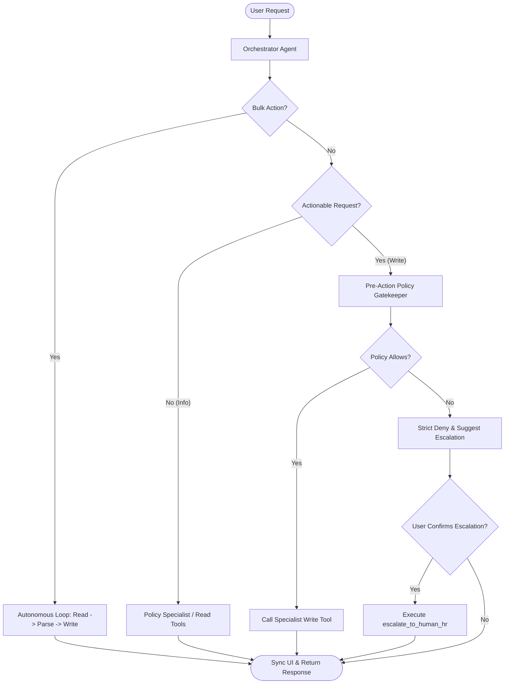

# Elevate HR: Complete Architecture & Query Flow

## Logic & Decision Flow Diagram

## 1. System Components
- **Client (Browser)**: Runs `index.html`. Handles the chat UI, the "My Hub" sidebar, and user identity selection.
- **FastAPI Backend (`ui/server.py`)**: Acts as the orchestrator for the UI. It hosts the REST endpoints (`/api/chat`, `/api/hub`, etc.). It also securely holds the agent session IDs in memory.
- **Agent Development Kit (ADK)**: The framework running the Orchestrator agent and its Sub-Agents. This is where reasoning, planning, and memory reside. The `active_conversation_id` tracks the agent's memory for the session.
- **FastMCP Servers**: Standardized tools servers. We have two:
  - `WorkWeek` (HCM: Leaves, Profile, Balances)
  - `ServiceImmediately` (ITSM: Tickets, Status, Escalations)
- **Policy Tool**: A static JSON RAG store of enterprise rules.

## 2. State & Session Management
Where is state stored?
- **UI Session State**: The UI generates a unique Session ID (`chat_session_id`) on the client.
- **Backend Session Mapping**: `ui/server.py` maps the `chat_session_id` to an ADK `conversation_id` in memory (`conversation_map = {}`). This ensures the ADK remembers the chat history across turns.
- **Agent Memory**: The ADK persists the conversation history (system prompts, user inputs, tool call traces, and responses) locally in `.agent_data`.
- **System of Record (Source of Truth)**: The mock SaaS backends (FastMCP) hold the actual state of leaves, balances, and tickets. The Agent is explicitly instructed **never** to answer queries about balances/tickets from its conversational memory, but always to perform a live read from FastMCP to avoid hallucinating stale data.

## 3. The Query Flow: "Close all my tickets"

When a user selects an identity and types `"Close all my tickets"`:

1. **Identity & Auth Injection**:
   - The UI grabs the selected identity (e.g., EMP-380) and its specific MCP authorization token.
   - It sends a POST request to `/api/chat` containing the `message`, `session_id`, `X-Employee-ID`, and `X-MCP-Token`.

2. **Backend Thread Context**:
   - `ui/server.py` receives the request. It injects the `X-MCP-Token` into a Python `ContextVar` (`ACTIVE_MCP_TOKEN_CV`). This allows deep downstream tool calls to securely read the token without passing it through the entire agent stack manually.

3. **Orchestrator Routing**:
   - The Orchestrator agent receives the message: "Close all my tickets".
   - It looks at its prompts and sees the **Multi-Step Autonomous Execution** rule: it must not act like a dumb chatbot and ask for IDs. It must autonomously read-then-write.
   - It delegates the task to the `itsm_specialist` sub-agent.

4. **Autonomous Read-Then-Write Loop**:
   - **Read**: The `itsm_specialist` calls `list_tickets("EMP-380")`.
   - **Tool Execution**: The `list_tickets` python function reads the `ACTIVE_MCP_TOKEN_CV` and sends a REST call to the FastMCP server, returning a JSON string of active tickets.
   - **Parse**: The `itsm_specialist` reads the JSON string and extracts all `ticket_id`s that are currently active.
   - **Write**: The `itsm_specialist` loops through the IDs and autonomously fires `update_ticket_status(ticket_id, status="Closed", ...)` for each one.

5. **Policy Gatekeeping (The Brick Wall)**:
   - Before executing any write tool, the agent runs a **Pre-Action Policy Evaluation**.
   - If a user requested something non-compliant (e.g., "Change Priority to 1"), the agent will trigger a **Strict Denial**.
   - **No Silent Downgrades**: The agent is explicitly forbidden from secretly modifying the user's non-compliant parameter (e.g., changing Priority 1 to 3) just to force the transaction through. It will halt the execution completely, throw a `> ⚠️ **Policy Non-Compliance Warning**`, explain the exact rules, and await user confirmation.

6. **Final Rendering & UI Sync**:
   - The Orchestrator summarizes the closed tickets and streams the markdown back to the UI.
   - The UI renders the message. 
   - The UI immediately triggers a background fetch to `/api/hub`, which fetches the live, updated state of the tickets directly from FastMCP, updating the "My Hub" sidebar in real-time.
