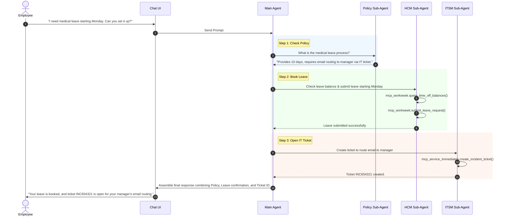

# HR Agentic Solution (MVP 1) Diagrams

## 1. System Architecture
This diagram illustrates the structural setup of the system, showing how the UI communicates with the Main Agent, and how the Main Agent delegates tasks to specialized sub-agents.

```mermaid
flowchart TD
    %% Styling
    classDef ui fill:#3182CE,stroke:#2B6CB0,stroke-width:2px,color:#fff
    classDef agent fill:#6B46C1,stroke:#553C9A,stroke-width:2px,color:#fff
    classDef tool fill:#48BB78,stroke:#2F855A,stroke-width:2px,color:#fff
    classDef backend fill:#ED8936,stroke:#C05621,stroke-width:2px,color:#fff

    subgraph UI ["User Interface Layer"]
        App[Web Chat Interface\n(app.js / styles.css)]:::ui
    end

    subgraph Orchestration ["ADK Orchestration Layer"]
        Router{Main Agent\n(hr_orchestrator)}:::agent
        SubPolicy[Policy Sub-Agent]:::agent
        SubHCM[WorkWeek Sub-Agent]:::agent
        SubITSM[ServiceImmediately Sub-Agent]:::agent
    end

    subgraph Integration ["MCP / Tools Layer"]
        ToolPolicy[Policy Retrieval Mock]:::tool
        ToolHCM[WorkWeek API Mock]:::tool
        ToolITSM[ServiceImmediately API Mock]:::tool
    end

    subgraph Enterprise ["Enterprise Backend Systems"]
        DBPolicy[(Policy Knowledge Base)]:::backend
        DBHCM[(WorkWeek HCM System)]:::backend
        DBITSM[(ServiceImmediately ITSM)]:::backend
    end

    %% Flow connections
    App <-->|Natural Language| Router
    
    Router --->|Routing / Intent| SubPolicy
    Router --->|Routing / Intent| SubHCM
    Router --->|Routing / Intent| SubITSM
    
    SubPolicy <--> ToolPolicy
    SubHCM <--> ToolHCM
    SubITSM <--> ToolITSM
    
    ToolPolicy <--> DBPolicy
    ToolHCM <--> DBHCM
    ToolITSM <--> DBITSM
```

<br><br>

## 2. Cross-System Interaction Flow (Sequence Diagram)
This sequence diagram demonstrates a complex, multi-agent conversational flow (e.g., an employee requesting medical leave that requires both checking a policy, submitting leave to the HCM, and opening an IT ticket for manager email access).


